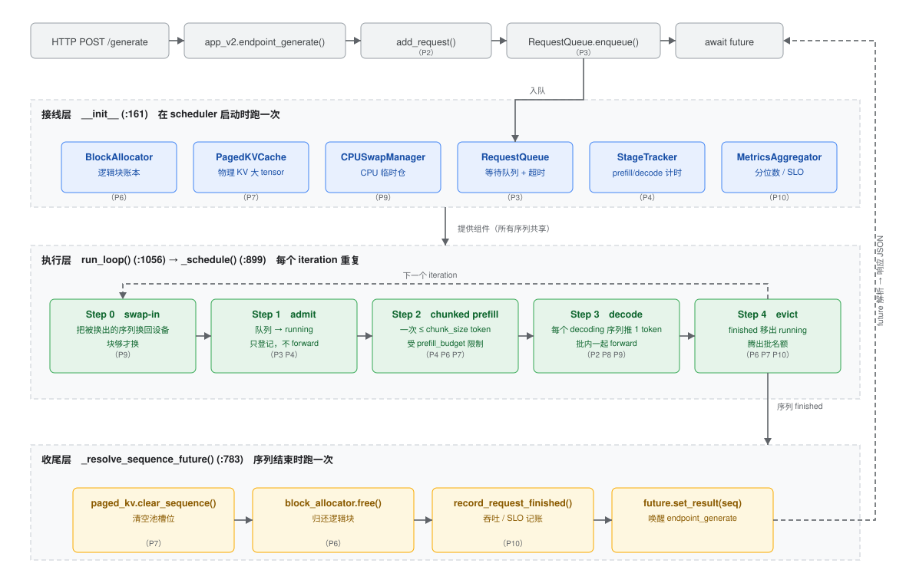

# vLLM_Inference_Engine · 中文学习 fork

<p align="center">
  <!-- README-I18N:START 不要手改这一行；用 scripts/check_readme_i18n.py 校验 -->
  <a href="README.md"></a>
  
  <!-- README-I18N:END -->
</p>

> 上游是 [TryingtobeingNikhil/vLLM_Inference_Engine](https://github.com/TryingtobeingNikhil/vLLM_Inference_Engine)
> （又名 **PageServe**）—— 一个把 LLM 推理引擎拆成 **11 个 Phase** 逐步搭起来的教学项目：
> 顺序服务基线 → 连续批处理 → 请求队列 → 分块 prefill → KV 分页 → CPU 换出 → 指标 → 压测。

**这个 fork 在它之上加了三样东西**，目的只有一个：**把"读代码"变成"看得到过程"**。

| # | 加的东西 | 规模 |
| --- | --- | --- |
| 1 | **中文学习注释**（`[LEARN]`/`[WHY]`/`[TRACE]`/`[GOTCHA]`） | 23 个文件，+1000 行注释，188 处标签 |
| 2 | **一套中文文档**（含 10 张 drawio 结构图） | 19 篇 / 6,500 行 |
| 3 | **调试工具链**（自动化环境 + 追踪日志 + 实验脚本） | 16 个脚本 + 3 个新 HTTP 接口 |



---

## 这个 fork 做了什么

### ① 代码里的中文学习注释

所有注释统一用 5 个标签，`rg` 就能按类型检索：

| 标签 | 含义 | 数量 |
| --- | --- | --- |
| `# [LEARN]` | 解释概念 / 算法 | 93 |
| `# [TRACE]` | 标注请求调用链中的一步 | 41 |
| `# [GOTCHA]` | 容易踩的坑 / 易错点 | 43 |
| `# [WHY]` | 设计取舍的理由 | 11 |

```bash
rg -n "# \[(LEARN|WHY|TRACE|GOTCHA)\]" inference_engine load_test
```

注释不只是"翻译代码"，重点是标注**容易搞反的地方**，例如：

- `async def` 的判据是「**函数体里有挂起点**」，不是"会在后台跑" —— 把 `_blocking` 那类函数
  改成 `async` 会产生**两种不报错的静默故障**；
- `ttft_ms` **不含排队时间**（真实 TTFT = `queue_wait_time_ms + ttft_ms`）；
- chunked prefill 里 **chunk 之间是串行的**，分块的目的不是加速而是"让出调度点"；
- `kv_block_size`（存储）和 `prefill_chunk_size`（计算）是**两把不同的尺子**，
  强行设成相等会让其中一边严重变坏。

### ② 一套中文文档（19 篇 / 6,500 行 / 10 张 drawio 图）

按「导航 → 主线 → 出口」组织，入口是 [`docs/0000-index.md`](docs/0000-index.md)：

| 分组 | 文档 |
| --- | --- |
| 🧭 **导航** | 0001 学习路线图+术语表 · 0002 调试与断点 · 0010 Phase 索引 · 0004 图表约定 |
| 📘 **主线：读代码** | 0005 一次 generate 讲透 Transformer/KV · 0006 调度器全貌 · 0007 Phase 2 实验清单 · **0014 分块 prefill 详解** |
| 🔧 **主线：深度机制** | 0011 停止条件与取消 · 0012 异步/阻塞/GIL · 0013 1ms 轮询与 OS 调度 · **0015 KV cache 的一生** |
| 🎯 **出口：走向真实系统** | **0016 简版↔真实版对照（vLLM/llm-d）** · **0017 容量规划** · **0018 约束解码** |
| 🧠 模型算法 | 0008 注意力演进 · 0009 注意力优化全景 |
| 🔍 代码体检 | 0003 设计局限与缺失功能（**F1~F34**） |

**这几篇是这个 fork 的主要产出**（都是上游没有的）：

| 文档 | 一句话 |
| --- | --- |
| [`0014`](docs/0014-prefill-and-chunking.md) | 分块 prefill：为什么能切、**顺序靠三个 offset 保证**、`chunk` vs `block`、`budget/chunk` 才是真正的旋钮、两套容器与抢占 |
| [`0015`](docs/0015-kv-cache-lifecycle.md) | KV cache 的**一生**：**KV 是模型里的 `W_k`/`W_v` 算的，引擎只搬运**；为什么要 pool；decode 为什么必须等自己的 prefill |
| [`0016`](docs/0016-simplified-vs-real-vllm.md) | **简版 ↔ 真实版对照手册**：本仓库概念 → vLLM/llm-d 对应物 + **读 vLLM 的 7 步顺序建议** |
| [`0017`](docs/0017-capacity-planning.md) | **容量规划**：10M DAU / 500K 峰值并发要多少 HBM 和主机内存（含假设清单与敏感性分析） |
| [`0018`](docs/0018-constrained-decoding.md) | **约束解码**：正则怎么可能作用在神经网络上（状态机 + logits 掩码 + 可运行的最小实现） |

### ③ 调试工具链：把"看不见的调度"变成"看得见的表和图"

上游只能 `curl` 看一坨 JSON。这个 fork 加了三个 HTTP 接口和几个脚本：

| 新增接口 | 作用 |
| --- | --- |
| `GET /trace` | **事件日志**：带 `N/8` 生命周期标号 + `[step NNN]` 调度轮次，可 grep |
| `GET /spans` | **span 树**（OTel 风格）：`request → queue_wait / prefill(+chunk#i) / decode(+token#i)` |
| `GET /docs` | FastAPI 自带的 Swagger UI（不用 curl 也能发测试请求） |

配套脚本（都在 `scripts/`）：

```bash
uv run python scripts/serve.py --phase 2          # 可断点的服务入口（不再只能 uvicorn）
uv run python scripts/demo_phase2.py --n 8        # 并发压一下 + 画文本瀑布图 + 打调度轨迹
uv run python scripts/demo_chunk_sizes.py         # 一条命令对比 chunk 512/128/32 的取舍
uv run python scripts/demo_constrained_decoding.py # 约束解码的最小实现（三级：if/else → 正则 → token 掩码）
uv run python scripts/capacity_estimate.py        # 容量估算（10M DAU / 500K 并发）
```

`demo_phase2.py` 跑完会直接打一张**文本瀑布图**（`q`=排队，`P`=prefill，`|`=chunk 边界，`d`=decode）：

```
[请求瀑布图]  横轴 = 相对 arrival；最长 2412ms；每格 40.2ms
  图例：q=排队  P=prefill（| 为 chunk 边界）  d=decode
  #1  655b73b8  qqqqqqqqqqPP|P|P|PPPPPPPPPPPPPPddddddddddddddddddddddddddddd  queue 438ms  prefill 837ms/4chunk  decode 1137ms/12tok  总 2412ms
  #4  077c55a7  qqqP|ddddddddddd                                              queue 158ms  prefill 52ms/1chunk   decode 473ms/6tok   总 683ms
```

---

## 快速开始

```bash
uv sync                                   # 建 .venv（pyproject.toml 由本 fork 新增）
uv run pytest inference_engine/tests -q   # 98 passed

# 起服务（Phase 2 = 连续批处理，:8001）。⚠️ 模型加载期间端口不监听，
# 此时 curl 会得到 Connection refused —— 这是正常的，等 "Uvicorn running on ..."
uv run python scripts/serve.py --phase 2

# 另开一个终端
uv run python scripts/demo_phase2.py --n 8 --max-new-tokens 24
```

- **交互式接口文档**：<http://127.0.0.1:8001/docs>
- **看调度轨迹**：<http://127.0.0.1:8001/trace?limit=200>
- **看 span 树**：<http://127.0.0.1:8001/spans?limit=5>

> ⚠️ 不需要 GPU：`config.py` 自动选设备（`cuda > mps > cpu`）。本 fork 的实测数据都来自 macOS + MPS。
> 首次运行会下载 `Qwen/Qwen2-0.5B`（~1GB）；已缓存的话可以加 `HF_HUB_OFFLINE=1` 跳过联网检查。

---

## 发现与修复

`docs/0003-code-review-findings.md` 里列了 **F1~F34** 条设计局限/缺失功能，
读代码时可以当"检查清单"用（读真 vLLM 时会看到它们逐个被解决）。本 fork **实际修了一条**：

| 编号 | 问题 | 状态 |
| --- | --- | --- |
| **F32** | `_prefill_chunk_blocking` 对**每个** chunk 都算完整 logits，但只有最后一个 chunk 才读它 —— `lm_head` 白算 | ✅ **已修**：prefill 传 `logits_to_keep=1`（启动时探测 transformers 是否支持）。**实测 prefill 快 23.7%**（裸模型）/ 端到端 685→518 ms |

其余 33 条**故意没动** —— 这个仓库的价值是"能看懂的最小实现"，
那些缺口更适合作为读生产级引擎时的对照项（[`0016`](docs/0016-simplified-vs-real-vllm.md) §4 把它们和 vLLM 的做法一一对应了）。

---

## 和上游的关系

- 上游代码（`inference_engine/`、`load_test/`、`web/`）**逻辑未改**，只加了注释 + F32 那一处修复；
- `docs/`、`scripts/`、`.vscode/`、`pyproject.toml` 是本 fork 新增的；
- 唯一的语义改动：`/trace`、`/spans` 两个新接口，`Sequence` 加了一个
  `prefill_chunk_latencies_ms` 字段（给 span 用），以及 F32 的 `logits_to_keep`。

上游 [README](README.md) 保持原样（英文，讲项目本身）。

---

## 致谢

上游 **PageServe** 把"从零搭一个推理引擎"拆成 11 个 Phase，是这个 fork 能成立的前提 ——
它足够小（每个 Phase 一个文件）、足够真（paged KV / 抢占 / 分块 prefill / 压测都有）、
又留了足够的空白让人去补文档。

本项目的中文文档里凡涉及真实系统（vLLM / llm-d / xgrammar / llguidance）的结论，
都标了来源或在文中注明"以你的版本为准"。
