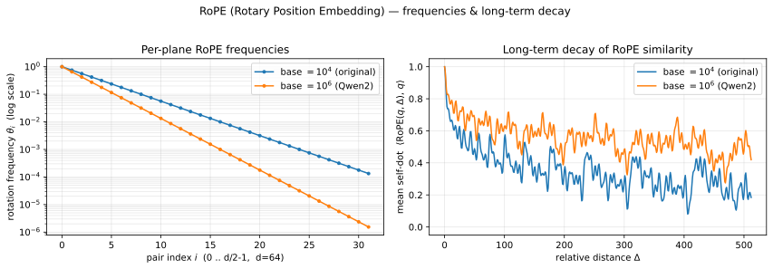
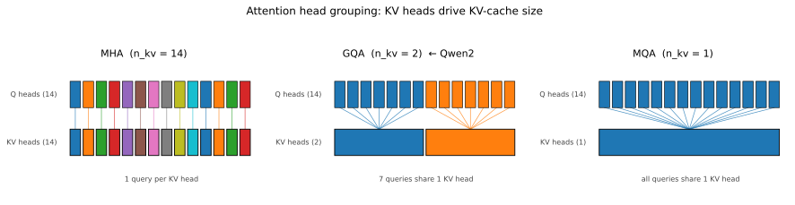
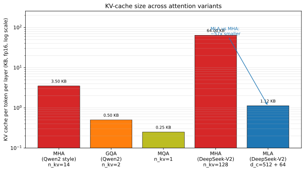
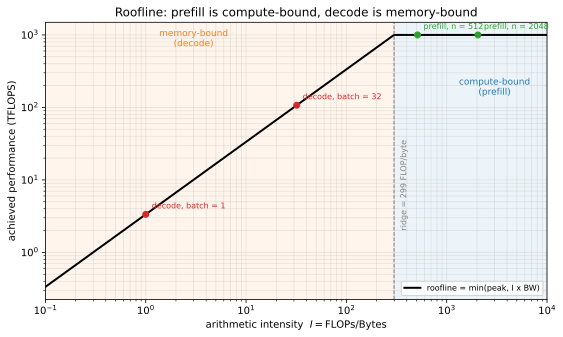

# 从一次 `generate()` 看 LLM 推理引擎到底在做什么

> 基于开源教学项目 **PageServe**（`inference_engine/engine/sequential.py`）的一次代码走读。
> 本文用一个最小的顺序推理实现，把「tokenizer、embedding、Transformer 前向、KV cache、采样、梯度」这些概念串成一条线。
>
> **公式渲染**：本文用 LaTeX 语法（`$...$` 行内、`$$...$$` 独立行）。
> 可直接在 GitHub / Typora / Obsidian / 支持 KaTeX 的博客引擎渲染。
> 在 VS Code 里预览请安装 *Markdown Preview Enhanced* 扩展，或打开同目录的
> `0005-blog-prefill-decode.html`（用浏览器看）。详见文末「如何预览」。

---

## 0. 背景：一个「幼稚但完整」的推理实现

`sequential.py` 是整个项目的第一阶段（Phase 1），刻意写得最朴素：

- 一次只服务一个请求（`server/app.py` 用 `asyncio.Lock` + 单 worker 线程池强制串行）；
- 不做批处理、不做 KV 分页管理、不做注意力优化；
- 只做**贪心解码**（greedy）。

它的价值在于：把「一次 LLM 生成」拆成了三段可以看清的代码，后面所有工程优化（continuous batching、paged KV cache、CPU swap）都是在这三段的边界上做文章。

```
prefill()   一次前向吃掉整段 prompt，产出 KV cache + 第一个 token
decode()    自回归循环，每次只喂上一个 token，复用 KV cache
generate()  把两者拼起来，统计 TTFT / 总时延 / 内存
```

---

## 1. 全景：一次 `generate()` 的生命周期

```
文本 prompt
  │  ① tokenizer(prompt)                         [CPU]  文字 → 整数 id
  ▼
input_ids  [1, prompt_len]  (int64)
  │  .to(device)
  ▼
┌── prefill() ───────────────────────────────────────────────┐
│  model.forward(input_ids)               [GPU/MPS]          │
│    embedding 查表 → 24 层 Transformer → lm_head → logits   │
│  产出: past_key_values (KV cache) + logits                 │
│  采样: argmax(logits[:, -1, :]) → first_token_id           │
└────────────────────────────────────────────────────────────┘
  │
  ▼
┌── decode() ── 循环 (max_new_tokens - 1) 次 ────────────────┐
│  model.forward(input_ids=[1,1], past_key_values=...)       │
│  采样 argmax → next_token_id → 追加 → 作为下一次输入        │
│  直到达到长度上限 或 命中 eos_token_id                      │
└────────────────────────────────────────────────────────────┘
  │
  ▼  ② tokenizer.decode(ids)                      [CPU]  整数 → 文字
文本 generated_text
```

各阶段的职责：

| 阶段 | 在哪算 | 输入 | 输出 | 是不是神经网络 |
| --- | --- | --- | --- | --- |
| ① tokenizer | CPU | 文本 | 整数 id | 否（查表） |
| embedding | GPU/MPS | 整数 id | 向量 | 是（第一层） |
| Transformer 前向 | GPU/MPS | 向量 | logits | 是 |
| 采样 | GPU→CPU | logits | 下一个 id | 否（argmax） |
| ② detokenize | CPU | 整数 id | 文本 | 否（查表） |

**一句话：引擎负责「文字 ↔ 整数」的搬运与调度；GPU 负责「整数 ↔ 向量 ↔ 分数」的神经网络运算。**

---

## 2. tokenizer：文字 ↔ 整数，**不是** embedding

代码（`prefill()`）：

```python
enc = tokenizer(prompt, return_tensors="pt")
input_ids = enc["input_ids"].to(device)
attention_mask = enc.get("attention_mask")
```

`tokenizer(...)` 返回一个 **`BatchEncoding`**（类 dict）。实测：对 `"你好 Paged attention"` 调用，得到

```
返回类型 : BatchEncoding
包含的键 : ['input_ids', 'attention_mask']
  input_ids      shape=(1, 4) dtype=torch.int64
  attention_mask shape=(1, 4) dtype=torch.int64
input_ids     : [[108386, 393, 3279, 6529]]
attention_mask: [[1, 1, 1, 1]]
```

逐项解释：

- **`tokenizer(prompt, ...)`** 内部流程：文本规范化 → 预分词 → BPE 切分 → 每个子词查词表得到 id → 加特殊 token → 生成 `attention_mask`。
- **`return_tensors="pt"`** 让结果打包成 **PyTorch 张量**（`pt` = PyTorch；也可 `np`/`tf`/`jax`）。**不写就返回普通 Python list**。
- **`enc["input_ids"]`**：token id 张量，形状 $[B, n]$（$B$=batch，$n$=序列长度），`dtype=int64`。
- **`attention_mask`**：同形状的 0/1 张量，**1 = 真实 token，0 = padding**。单条 prompt 全是 1；批处理补齐时才用它告诉模型「这些位置是填充，别 attend」。代码用 `.get(...)` 并判空，是因为某些 tokenizer 不返回它。
- **`.to(device)`**：把整数张量从 CPU 拷到模型所在设备。

这里**没有任何向量、没有神经网络**。把 id 变成向量是下一节、在模型内部完成的。

> 本项目中 Qwen2-0.5B 使用 **byte-level BPE**，词表大小 $V = 151936$。中文/英文/代码共用一套词表，所以 `Paged` 会被切成 `P` + `aged`，而「你好」可能只占一个 token。

---

## 3. embedding：整数 → 向量，模型的第一层

模型的第一层是一个**可学习的查表矩阵**（embedding table）：

$$
E \in \mathbb{R}^{V \times d}, \qquad e_t = E[x_t] \in \mathbb{R}^{d}
$$

其中 $x_t \in \{0, 1, \dots, V-1\}$ 是第 $t$ 个 token 的 id，$d$ 是 hidden size。

对 Qwen2-0.5B 实测：

```
vocab_size        : 151936
hidden_size       : 896
embedding layer   : Embedding (151936, 896)     # 约 1.36 亿参数
lm_head           : (151936, 896)，与 embedding 共享权重（tie_word_embeddings=True）
```

即每一个 token id 被映射成一个 896 维向量。这就是原始 Transformer 论文里的 **Input Embedding**——它一直都在，只是发生在 `model(...)` 内部，而不是 tokenizer 那一步。

> “embedding” 一词有两种常见含义：口语里指「把文本编码成向量」，而模型层里的 `nn.Embedding` 特指这张查表矩阵。本文指后者。

位置信息不在这里加。Qwen2 使用 **RoPE（旋转位置编码）**，在每一层注意力里对 $Q, K$ 施加旋转，见下节。

---

## 4. Transformer 前向：一次 forward 到底算什么

`model(...)` 就是 HuggingFace 的 `Qwen2ForCausalLM.forward`。对长度为 $n$ 的输入，它在设备上依次做：

### 4.1 每一层的注意力（完整推导）

以 Qwen2-0.5B 的一个 decoder 层为例。输入 $X \in \mathbb{R}^{n\times d}$，$n$ 是序列长度，$d=896$。

**第 1 步：线性投影出 Q、K、V**

$$
Q = XW_Q + b_Q,\qquad K = XW_K + b_K,\qquad V = XW_V + b_V
$$

对应代码里的 `q_proj` / `k_proj` / `v_proj`。Qwen2 的这几个投影**带 bias**：

| 矩阵 | Qwen2 形状 | 说明 |
| --- | --- | --- |
| $W_Q$ | $896\to896$ | $14$ 头 $\times\,64$ |
| $W_K$ | $896\to128$ | $2$ 头 $\times\,64$（GQA） |
| $W_V$ | $896\to128$ | $2$ 头 $\times\,64$（GQA） |

**第 2 步：拆成多头**

把 Q 重塑为 $[n, n_h, d_h]=[n,14,64]$，K、V 重塑为 $[n, n_{kv}, d_h]=[n,2,64]$。

GQA 下每个 KV 头服务 $n_h/n_{kv}=14/2=7$ 个 query 头：query 头 $h$ 取 KV 头 $\lfloor h/7\rfloor$。

**第 3 步：对 Q、K 施加 RoPE**（按位置旋转；V 不转）。

**第 4 步：算分数（缩放点积）**

对第 $h$ 个注意力头（记其 KV 头为 $g(h)$）：

$$
S^{(h)} = \frac{Q^{(h)}\, {K^{(g(h))}}^\top}{\sqrt{d_h}} + M \;\in\; \mathbb{R}^{n\times n}
$$

其中 $Q^{(h)}\in\mathbb{R}^{n\times d_h}$，$d_h=64$，所以缩放因子 $\sqrt{d_h}=8$。$M$ 是**因果掩码**：

$$
M_{ij} = \begin{cases} 0, & j \le i \\ -\infty, & j > i \end{cases}
$$

**为什么要除以 $\sqrt{d_h}$？** 若 q、k 各分量近似独立、均值为 0、方差为 1，则点积 $q\cdot k=\sum_{i=1}^{d_h} q_i k_i$ 的方差是 $d_h$。不缩放的话 $d_h$ 越大分数越极端，softmax 会被推向饱和（几乎 one-hot），梯度几乎消失。除以 $\sqrt{d_h}$ 把方差拉回 $\approx1$，softmax 才待在健康区间。

**第 5 步：softmax 得到注意力权重**

$$
A^{(h)} = \mathrm{softmax}\big(S^{(h)}\big),\qquad
A^{(h)}_{ij} = \frac{e^{\,S^{(h)}_{ij}}}{\sum_{j'=1}^{n} e^{\,S^{(h)}_{ij'}}}
$$

第 $i$ 行表示「位置 $i$ 要把多少注意力分给各位置」。因为掩码把 $j>i$ 设成 $-\infty$，那些位置权重为 0——这就是「只能看过去」（自回归 / causal LM）。

**第 6 步：加权求和**

$$
O^{(h)} = A^{(h)}\, V^{(g(h))} \;\in\; \mathbb{R}^{n\times d_h}
$$

**第 7 步：拼接 + 输出投影**

$$
O = \mathrm{Concat}\big(O^{(1)},\dots,O^{(n_h)}\big)\, W_O
$$

$W_O$ 形状 $896\to896$（Qwen2 的 `o_proj` **不带** bias）。

把上述合成一行，就是常见写法：

$$
\mathrm{Attn}(Q,K,V) = \mathrm{softmax}\!\left(\frac{QK^\top}{\sqrt{d_h}} + M\right)V
$$

**Softmax 定义：**

$$
\mathrm{softmax}(z)_i = \frac{e^{z_i}}{\sum_{j=1}^{V} e^{z_j}}
$$

> 符号提醒：这里的 $V$ 在**采样**（第 6 节）里是词表大小；在**注意力**里求和范围是序列长度 $n$。两个公式只是恰好用了同一个字母。

**连回 KV cache**：decode 时 $Q$ 只有 1 行（新 token），而 $K,V$ 用的是缓存里的 $n$ 行，所以 $S^{(h)}$ 是 $1\times n$，softmax 后与 $V$ 加权得到一个 $d_h$ 维向量——这正是「每步只算一个 token」的数学表达（见第 5 节）。

**连回代码**：`Qwen2Attention.forward` 做投影、拆头、RoPE、缩放点积；HuggingFace 会根据环境选择 `eager` / `sdpa` / `flash_attention_2` 实现同一套数学。本项目在 `attention_wrapper.py` 里从 paged pool 重建 KV，以支持 swap-in。

> 补充：Qwen2 **没有** QK-norm（把 RMSNorm 加到 Q、K 上），所以上面的 $\sqrt{d_h}$ 缩放是唯一稳定项；后续的 Qwen3 才引入了 qk-norm。

### 4.2 位置编码：注意力天生“不知道顺序”

自注意力对输入顺序是**置换等变**的：把 token 顺序打乱，输出只会跟着打乱，注意力分数本身不变。用置换矩阵 $P$ 表示：

$$
\mathrm{Attn}(PX) = P\,\mathrm{Attn}(X)
$$

也就是说，「猫追狗」和「狗追猫」在纯注意力眼里没有区别。所以必须**额外注入位置信息**。

历史上大致三条路线：

**(1) 绝对位置编码**——把位置向量加到 embedding 上。

- 可学习（GPT-2）：$P \in \mathbb{R}^{n_{\max}\times d}$，一个位置一行。
- 正弦（原始 Transformer）：

$$
PE_{(pos,2i)} = \sin\!\big(pos/10000^{2i/d}\big),\qquad
PE_{(pos,2i+1)} = \cos\!\big(pos/10000^{2i/d}\big)
$$

绝对编码的问题：只编码「我是第几位」，不直接表达「两个 token 相距多远」；可学习的表超过训练长度后就失效（无法外推）。

**(2) 相对位置**：直接建模距离，比如 T5 的相对位置偏置，或 Shaw 等人的相对编码。

**(3) RoPE（旋转位置编码）**：Qwen2 / LLaMA / Mistral 都用这个。核心思想是**把 q、k 按位置旋转一个角度**：

$$
\text{RoPE}(q, m) = R_{\Theta,m}\,q,\qquad \text{RoPE}(k, n) = R_{\Theta,n}\,k
$$

其中 $R_{\Theta,m}$ 是由多个二维旋转块组成的正交矩阵，旋转角与位置 $m$ 成正比。它有一个很漂亮的恒等式：

$$
\langle R_{\Theta,m}\,q,\; R_{\Theta,n}\,k\rangle = \langle q,\; R_{\Theta,n-m}\,k\rangle
$$

**左边用的是绝对位置 $m,n$，右边的结果只依赖相对距离 $n-m$。** 这就是大家喜欢它的原因：

- 用绝对位置的实现，拿到相对位置的性质，且**不增加任何参数**；
- 天然带有「随距离增长而衰减」的倾向（很多维度上旋转差越大、点积越小），符合「近的词更相关」的语言直觉；
- 只需作用在 Q、K 上（V 是内容、不参与打分，不用转），实现简单、可插拔；
- 外推性好，配合 $\theta$ 调整 / NTK / YaRN 能扩到很长上下文。

- 外推性好，配合 base（`rope_theta`）调整 / NTK / YaRN 能扩到很长上下文。

**具体长什么样：把 64 维拆成 32 个二维平面**

以 Qwen2 的 $d_h=64$ 为例。RoPE 不是对所有维度用同一个角度，而是把向量每两个维度配成一对，得到 $d_h/2 = 32$ 个「二维平面」；第 $i$ 对（$i=0,\dots,31$）绕自己的平面旋转角度

$$
\theta_i = b^{-2i/d_h}, \qquad \text{angle}_i(m) = m\,\theta_i,
\qquad b = \text{rope\_theta}
$$

每个平面的旋转就是普通二维旋转：

$$
\begin{bmatrix} x'_{i} \\ x'_{i+d_h/2} \end{bmatrix}
=
\begin{bmatrix} \cos(m\theta_i) & -\sin(m\theta_i) \\ \sin(m\theta_i) & \cos(m\theta_i) \end{bmatrix}
\begin{bmatrix} x_{i} \\ x_{i+d_h/2} \end{bmatrix}
$$

把 32 个 $2\times2$ 块沿对角线拼起来，就是

$$
R_{\Theta,m}=\mathrm{diag}\Big(R(m\theta_0),\,R(m\theta_1),\dots,R(m\theta_{31})\Big)
$$

（代码里通常不真的构造这个矩阵，而是用 `rotate_half` 加预计算好的 $\cos,\sin$ 做等价计算，省显存。）

**多尺度：不同维度用不同频率。** $\theta_i$ 随 $i$ 指数下降：$i$ 小的维度转得快（高频，编码近距离），$i$ 大的维度转得慢（低频，编码远距离）。用 Qwen2 的 base 实测：

| | $\theta_0$ | $\theta_{16}$ | $\theta_{31}$ | 最慢维度的周期 $2\pi/\theta_{31}$ |
| --- | --- | --- | --- | --- |
| base $=10^4$（原始）| $1$ | $10^{-2}$ | $1.33\times10^{-4}$ | 约 47k 个位置 |
| base $=10^6$（Qwen2）| $1$ | $10^{-3}$ | $1.54\times10^{-6}$ | 约 4.08M 个位置 |

base 从 $10^4$ 提到 $10^6$，所有频率整体变小、旋转变慢，最慢维度的周期从 4.7 万拉到 408 万——这就是 Qwen2 能标 128K 上下文的原因。

**图：频率与长程衰减**



> 左：32 个平面的旋转频率 $\theta_i$（对数轴），base 越大整条曲线越低。
> 右：同一个向量旋转 $\Delta$ 个位置后，与原向量的平均内积随距离的衰减；base $=10^6$（Qwen2）衰减明显更慢，因此能覆盖更长的上下文。
> 图由 [`scripts/plot_rope.py`](../scripts/plot_rope.py) 生成，可重跑。

> ⚠️ 有论文（arXiv:2410.06205）质疑「长程衰减」是否是 RoPE 有效的主因，所以上面那条衰减性质当成「常见的直觉解释」而非定论。

**Qwen2 的具体选择**：`rope_type=default`，`rope_theta = 1e6`（原始 Transformer 是 $10^4$）。把 $\theta$ 调大，等于让旋转更「慢」，相邻位置的角度差更小，从而支持更长的上下文——这是它 `max_position_embeddings = 131072`（128K）的基础。

**其他方案**：ALiBi 直接在注意力分数上加一个与距离成正比的惩罚项（无需位置嵌入、外推好），但如今主流（LLaMA/Qwen/Mistral）是 RoPE；也有 NoPE（完全不加位置）在部分设定下可用。

---

### 4.3 归一化：为什么放在子层“前面”

**为什么需要归一化**：深层网络里激活值尺度会逐层漂移，容易爆炸/消失。归一化把每个 token 的向量拉回稳定尺度，训练才稳。

**LayerNorm**（对单个 token 的特征维做标准化）：

$$
\mathrm{LN}(x) = \gamma \odot \frac{x-\mu}{\sqrt{\sigma^2+\epsilon}} + \beta,\qquad
\mu=\frac{1}{d}\sum_{i=1}^{d}x_i,\quad
\sigma^2=\frac{1}{d}\sum_{i=1}^{d}(x_i-\mu)^2
$$

它在**特征维**上算、与 batch 无关（这也是 Transformer 用 LN 而不是 BatchNorm 的原因：推理时不受 batch 组成影响）。

**RMSNorm**（去掉均值中心化和 bias，只按均方根缩放）：

$$
\mathrm{RMSNorm}(x) = \gamma \odot \frac{x}{\sqrt{\frac{1}{d}\sum_{i=1}^{d}x_i^2+\epsilon}}
$$

少算一个均值和方差，更快，效果通常不输 LayerNorm。Qwen2 用的是 `Qwen2RMSNorm(896, eps=1e-6)`。

**为什么放「前面」（Pre-LN vs Post-LN）** 才是关键：

- **Post-LN**（原始论文）：$x \leftarrow \mathrm{LN}\big(x + f(x)\big)$，归一化放在残差**之后**。深层（>10 层）时不稳定，必须靠学习率 warmup。
- **Pre-LN**（现代主流）：$x \leftarrow x + f\big(\mathrm{LN}(x)\big)$，归一化放在子层**输入**上，残差加法保留**未归一化**的主干。这样主干有一条「恒等高速路」，深层也能稳定训练、通常不需要 warmup。

Qwen2 的每个 decoder 层正是 Pre-LN：

$$
h' = h + \mathrm{Attn}\big(\mathrm{RMSNorm}(h)\big)
$$

$$
h'' = h' + \mathrm{MLP}\big(\mathrm{RMSNorm}(h')\big)
$$

对应到代码里的两个 norm：`input_layernorm`（注意力**前**）、`post_attention_layernorm`（MLP **前**）。所以你看到的顺序不是随便排的，而是「先归一化再进子层」的固定模式；最后送进 lm_head 前还会再过一次最终 norm。

> 补充：有研究表明 Pre-LN 对**深层**更稳，而 Post-LN 在**很浅**（≤6 层）时反而可能更好（arXiv:2002.04745）——是个权衡，不是绝对。

---

### 4.4 残差连接：为什么每层都要“加回去”

每个子层都是 $x \leftarrow x + f(x)$。这个「加回去」有两个作用：

1. **梯度高速路**：反向传播时 $\partial\big(x+f(x)\big)/\partial x$ 含一个恒等项 $1$，梯度不会因为层数多而消失；
2. **集成视角**：展开 $L$ 层残差，相当于对 $2^L$ 条不同深度的子网络求和，浅层特征能直接流到深层。

没有残差，24 层的网络很难训起来。

---

### 4.5 MLP / FFN：注意力负责“混”，MLP 负责“变”

- **注意力**在 token **之间**混合信息（谁看谁）；
- **MLP**在每个 token **内部**做非线性特征变换（逐位置、互不干扰）。

两者缺一不可：一个负责路由，一个负责加工。

经典 FFN 是两层加激活、中间约 4 倍宽：

$$
\mathrm{FFN}(x) = W_2\,\sigma(W_1 x)
$$

现代模型多用**门控**变体（GLU 家族）：

$$
\mathrm{FFN}(x) = W_{\text{down}}\Big(\sigma(W_{\text{gate}}\,x) \odot W_{\text{up}}\,x\Big)
$$

其中 $\sigma$ 是 $\mathrm{SiLU}(z)=z\cdot\sigma_{\text{sigmoid}}(z)$ 时叫 **SwiGLU**（PaLM/LLaMA/Qwen 采用），用 GELU 时叫 GeGLU（两者效果接近）。因为多了一个矩阵，$d_{\text{ff}}$ 通常会相应调整。

Qwen2 实测：`hidden_act = silu`，所以就是 SwiGLU；三个矩阵形状是 $896\!\to\!4864$、$896\!\to\!4864$、$4864\!\to\!896$。

**一个值得注意的数字**：每层 MLP 的参数约 $3\times896\times4864\approx13.1\text{M}$，而该层注意力投影只有约 $1.8\text{M}$。也就是说**每层约 88% 的线性参数在 MLP 里**。这直接解释了上一节为什么 decode 每步要读 715MB 权重——大头就是 MLP。

---

### 4.6 注意力家族：MHA → MQA → GQA → MLA

- **MHA**（多头注意力，原始 Transformer）：query 头数和 key/value 头数相同，$n_h = n_{kv}$。
- **MQA**（多查询注意力）：所有 query 头共享**同一组** K/V，$n_{kv}=1$。KV 显存大降，但质量有损失。
- **GQA**（分组查询注意力）：居中方案，$1 < n_{kv} < n_h$，把 query 头分组、每组共享 K/V。

**为什么关心 $n_{kv}$**：KV cache 的大小正比于 $n_{kv}$（见第 5 节的公式），而 decode 是 memory-bound，KV 越小越省带宽、越能支持长上下文和高并发。

Qwen2-0.5B 实测就是 GQA：$n_h=14$、$n_{kv}=2$，即每 7 个 query 头共享一组 K/V。对应到代码：

```
q_proj: 896 → 896   (= 14 头 × 64)
k_proj: 896 → 128   (=  2 头 × 64)
v_proj: 896 → 128   (=  2 头 × 64)
o_proj: 896 → 896
```

如果换成 MHA（$n_{kv}=14$），KV cache 会是现在的 7 倍——这就是 GQA 存在的意义。



> 图：[`scripts/plot_gqa_heads.py`](../scripts/plot_gqa_heads.py) 生成。可以看到每个 KV 头被多少个 query 头共享。

**MLA（Multi-head Latent Attention）—— DeepSeek 的做法**

MQA/GQA 的思路是**减少 KV 头数**；MLA 的思路完全不同：**压缩被缓存的东西**。它不再按头缓存完整的 K、V，而是把每个 token 的 KV 压成一个**低秩隐向量**，用到时再投影回去。

对第 $t$ 个 token 的隐状态 $h_t$：

$$
c_t^{KV} = W^{DKV} h_t \in \mathbb{R}^{d_c} \quad\text{（下投影，只缓存它）}
$$

$$
k_t^{C} = W^{UK} c_t^{KV}, \qquad v_t^{C} = W^{UV} c_t^{KV} \quad\text{（上投影回每头的 K、V）}
$$

为了让 RoPE 仍然可用，额外加一路**解耦的 RoPE 键**：

$$
k_t^{R} = \mathrm{RoPE}(W^{KR} h_t), \qquad k_t = [\,k_t^{C};\, k_t^{R}\,], \qquad v_t = v_t^{C}
$$

**真正被缓存的只有 $\{c_t^{KV},\ k_t^{R}\}$**，即每 token 每层 $d_c + d_h^{R}$ 个元素。

DeepSeek-V2 取 $d_c = 512$、$d_h^{R} = 64$；若用同模型的 MHA（$n_h=128,\ d_h=128$），每 token 每层要缓存 $2\times128\times128 = 32768$ 个元素——MLA 只要 $576$ 个，约 **57×** 更小。

> 推理时还有个技巧叫「矩阵吸收」：因为 $q\cdot k^{C} = (W^{Q}h)\cdot(W^{UK}c) = (W^{UK\top}W^{Q}h)\cdot c$，可以把 $W^{UK}$ 吸进 $W^{Q}$、把 $W^{UV}$ 吸进 $W^{O}$，于是不必显式物化每头的 K、V——MLA 在计算上表现得像 MHA，但缓存小得多。这也是它比 GQA 更难实现的原因（需要自定义 kernel 才高效）。



> 图：[`scripts/plot_kv_cache_variants.py`](../scripts/plot_kv_cache_variants.py) 生成（对数轴）。左侧三根是 Qwen2 风格（看 head 数的影响），右侧两根是 DeepSeek-V2（看 MLA 相对 MHA 的压缩，约 57×）。

> ⚠️ 取舍：MLA 把「减少头数」换成「压缩表示」，压缩率更高，但实现复杂，且过度压缩会损失质量。更新的 DeepSeek 版本还在探索稀疏注意力等进一步降低长上下文成本的方向。

> 顺带一个小差异：Qwen2 的 q/k/v 投影带 bias（`bias=True`），o_proj 不带；这一点和 LLaMA 不同。

---

### 4.7 输出 logits

最后一层归一化后的隐状态 $h \in \mathbb{R}^{d}$ 通过 LM head 投到词表维度：

$$
z = W_{\text{lm}}\, h \in \mathbb{R}^{V}
$$

$z$ 就是 **logits**（未归一化分数）。代码里形状是 $[1, n, V]$。

---

## 5. 自回归与 KV cache：为什么 decode 越来越快

语言模型把联合概率按时间分解：

$$
p_\theta(y_{1:T} \mid x) = \prod_{t=1}^{T} p_\theta(y_t \mid y_{<t}, x)
$$

### 5.1 prefill vs decode

- **prefill**：一次处理整段 prompt（$n$ 个 token）。注意力矩阵是 $n \times n$，复杂度 $O(n^2 d)$。
- **decode**：每步只处理 1 个新 token，去注意已有的 $t$ 个 key/value，复杂度 $O(t\, d)$。

写到第 $t$ 步、带缓存的注意力是：

$$
\mathrm{Attn}(q_t, K_{1:t}, V_{1:t}) = \sum_{i=1}^{t} \alpha_{t,i}\, v_i,
\qquad
\alpha_{t,i} = \frac{e^{\,q_t \cdot k_i / \sqrt{d_k}}}{\sum_{j=1}^{t} e^{\,q_t \cdot k_j / \sqrt{d_k}}}
$$

### 5.2 KV cache 省了什么

没有 cache 时，每生成一个 token 都要把整段历史重新前向一次，总代价约

$$
O(T \cdot n^2 d)
$$

有 cache 时，历史只算一次并缓存 $K, V$，总代价约

$$
O(n^2 d) + O(T \cdot n d)
$$

这就是为什么 `decode()` 每轮只喂 **1 个 token**：

```python
current_token = torch.tensor([[next_token_id]], dtype=torch.long, device=device)
outputs = model(input_ids=current_token, past_key_values=past_key_values, use_cache=True, ...)
past_key_values = outputs.past_key_values   # 缓存滚雪球式增长
```

### 5.3 缓存到底占多少显存

KV cache 的字节数：

$$
\text{bytes} = \underbrace{2}_{\text{K 和 V}} \times L \times n_{kv} \times d_h \times S \times b
$$

其中 $L$ 是层数，$n_{kv}$ 是 KV 头数（GQA 下小于注意力头数），$d_h$ 是头维度，$S$ 是序列长度，$b$ 是每元素字节数。

> 这个公式适用于 MHA / GQA / MQA。**MLA（DeepSeek）缓存的是低秩隐向量，公式不同**，见 4.6 节。

代入 Qwen2-0.5B（$L=24,\ n_{kv}=2,\ d_h=64,\ b=2$，fp16）：

$$
\text{bytes/token} = 2 \times 24 \times 2 \times 64 \times 2 = 12288 \ \text{B} = 12\ \text{KB}
$$

这正是项目启动时打印的 `Bytes per token: 12.00 KB`。可见 KV cache 会随并发序列数线性增长——这就是后面要用 **paged KV cache** 和 **CPU swap** 的动机。

> 注意：prefill 是**计算受限**（compute-bound，大矩阵乘）；decode 是**显存带宽受限**（memory-bandwidth bound，每步只做小矩阵乘但要读整个 KV）。二者特性不同，这是推理引擎要分开优化的根本原因。

---

## 6. 采样：从 logits 到下一个 token

代码：

```python
next_token_id = int(logits[:, -1, :].argmax(dim=-1).item())
```

拆解（`logits` 形状 $[1, 1, V]$）：

| 片段 | 结果 | 含义 |
| --- | --- | --- |
| `logits[:, -1, :]` | $[1, V]$ | 取**最后一个位置**的分数（因果模型用它预测下一个 token） |
| `.argmax(dim=-1)` | $[1]$ | 在词表维度取最大值的下标 |
| `.item()` → `int(...)` | Python `int` | 转成整数 |

即贪心解码：

$$
\hat{y}_t = \arg\max_{i \in \{1,\dots,V\}} z_{t,i}
$$

**为什么不用先做 softmax？** 因为 softmax 是单调的：

$$
\arg\max_i \frac{e^{z_i}}{\sum_j e^{z_j}} = \arg\max_i z_i
$$

所以贪心只需对原始 logits 取 argmax。只有要做**采样**（temperature / top-k / top-p）时才需要先 softmax 得到概率：

$$
p_i = \mathrm{softmax}\!\left(\frac{z}{T}\right)_i
$$

---

## 7. 前向 vs 反向：为什么推理要关梯度

### 7.1 前向和反向分别是什么

- **前向（forward）**：从输入算出输出，$y = f(x;\theta)$。
- **反向（backward）**：只在**训练**时需要，用链式法则算出损失对每个参数的**梯度**，再更新参数。

训练的一步是：

1. 前向算 logits；
2. 交叉熵损失

$$
\mathcal{L}(\theta) = -\frac{1}{T}\sum_{t=1}^{T} \log p_\theta(y_t \mid y_{<t}),
\qquad
p_\theta(y_t \mid y_{<t}) = \mathrm{softmax}(z_t)_{y_t}
$$

3. 反向求梯度（链式法则）：

$$
\frac{\partial \mathcal{L}}{\partial \theta^{(\ell)}}
= \frac{\partial \mathcal{L}}{\partial h^{(L)}}
\prod_{k=\ell}^{L} \frac{\partial h^{(k+1)}}{\partial h^{(k)}}
\frac{\partial h^{(\ell)}}{\partial \theta^{(\ell)}}
$$

4. 梯度下降更新：

$$
\theta \leftarrow \theta - \eta\, \nabla_\theta \mathcal{L}
$$

### 7.2 为什么推理要关掉梯度

要能反向，PyTorch 必须在前向时**记录一张计算图**并**保存中间激活张量**（activation）。这对训练是必要的，但对推理是纯浪费：

- **显存**：中间激活往往比参数本身还占地方；推理时这块钱应该留给 KV cache 和并发；
- **速度**：每个算子都有 autograd 记账开销。

推理只做前向，永远不调 `.backward()`，所以：

```python
with torch.inference_mode():
    outputs = model(...)
```

`torch.inference_mode()` 会关闭梯度记录并启用推理优化。它比 `torch.no_grad()` 更彻底（连张量版本计数都不记），并把这段时间产生的张量标记为 inference tensor，防止之后误用。

### 7.3 为什么 `prefill` 和 `decode` 各写一次？

因为它是一个**上下文管理器**，作用域只在 `with` 块内：进入时打开、退出时恢复。两个函数是两次独立调用，各自包一层即可。也可以把整个 `generate()` 包一层——**嵌套是允许的**（内部有计数器）。

### 7.4 别的推理引擎也这么做吗？

**是，几乎是行业标准：**

- HuggingFace `model.generate()` 内部本身就包了 `torch.no_grad()` / inference_mode；
- vLLM / TGI / TensorRT-LLM 都在无梯度模式下运行，且常换成自定义 CUDA kernel；
- ONNX Runtime / TensorRT / OpenVINO / llama.cpp 是 **inference-only 运行时**，根本没有 autograd。

所以「推理关梯度」不是本项目特有，而是通用实践。

---

## 8. 计算瓶颈：为什么 prefill 是 compute-bound，decode 是 memory-bound

“关掉梯度”和“没有主要计算”是两回事。**前向本身就有大量矩阵乘**，这才是 GPU 的主要计算。

### 8.1 前向的主要计算 = 矩阵乘（GEMM）

一次前向里，除了 embedding 查表和归一化，真正吃算力的是这些**线性层**：

- 每层的 $W_Q, W_K, W_V, W_O$（注意力投影）
- 每层的 MLP：$W_{\text{gate}}, W_{\text{up}}, W_{\text{down}}$
- 最后的 LM head $W_{\text{lm}}$

一个矩阵乘的 FLOPs 是：

$$
\text{FLOPs}\big([m\times k]\cdot[k\times n]\big) = 2\,m\,k\,n
$$

因此**每个 token 的线性部分大约 $2P$ FLOPs**（$P$ = 非 embedding 参数量，每个参数参与一次乘、一次加）。

### 8.2 算术强度与 Roofline

硬件有两个上限：算力 $\pi_{\text{peak}}$（FLOP/s）和带宽 $\beta$（Byte/s）。能否跑满算力，取决于**算术强度**：

$$
I = \frac{\text{FLOPs}}{\text{Bytes moved}}
$$

Roofline 模型：

$$
\text{Performance} \le \min\big(\pi_{\text{peak}},\; I \cdot \beta\big)
$$

分界点（ridge point）$I^* = \pi_{\text{peak}} / \beta$。$I < I^*$ 就是 **memory-bound**，$I > I^*$ 才是 **compute-bound**。

### 8.3 代入 Qwen2-0.5B 的真实数字

实测该模型 $d=896,\ L=24,\ n_h=14,\ n_{kv}=2,\ d_h=64,\ \text{ffn}=4864,\ V=151936$：

| 量 | 值 |
| --- | --- |
| 每层线性参数 | 14.91 M |
| 全部线性参数 $P$ | **357.8 M** |
| embedding（与 lm_head 共享） | 136.1 M |
| 合计 | 494.0 M（≈0.5B）✓ |
| 每 token 线性 FLOPs ≈ $2P$ | **0.716 GFLOP** |
| 每步 decode 需读的权重（fp16） | **715.7 MB** |

算术强度：

- **decode（1 个 token）**：$I \approx \dfrac{2P}{bP} = \dfrac{2}{b} \approx 1$ FLOP/byte（fp16，$b=2$）。
- **prefill（$n$ 个 token）**：权重只读一次、复用 $n$ 次，$I \approx n$ FLOP/byte。

| 阶段 | 线性 FLOPs | 注意力 FLOPs | 算术强度 | 瓶颈 |
| --- | --- | --- | --- | --- |
| decode（n=1） | 0.716 GFLOP | ~0 | ≈ 1 | **memory-bound** |
| prefill n=128 | 91.6 GFLOP | 1.4 GFLOP | ≈ 128 | 介于之间 |
| prefill n=512 | 366.4 GFLOP | 22.5 GFLOP | ≈ 512 | **compute-bound** |
| prefill n=2048 | 1465.7 GFLOP | 360.8 GFLOP | ≈ 2048 | **compute-bound** |

参照：H100 SXM 的 ridge point 约为几十~几百 FLOP/byte（取决于精度，参考值：TF32 下 ≈ 295；来源见文末）；Apple/消费级 GPU 更低（几十量级）。

**结论：**

- **prefill**：$m=n$ 是大矩阵乘，权重读一次用 $n$ 次 → 算力打满 → **compute-bound**。注意 $n$ 很大时注意力项 $O(n^2)$ 才开始赶上（上表 n=2048 时注意力已占 ~20%）。
- **decode**：$m=1$，矩阵乘退化成**矩阵-向量乘（GEMV）**，每个权重读进来只用一次 → 算力空转、被带宽拖住 → **memory-bound**。每生成 1 个 token 都要把 715.7 MB 权重从显存里流一遍。



> 图：[`scripts/plot_roofline.py`](../scripts/plot_roofline.py) 生成（峰值算力/带宽为量级示意）。横轴越靠右越是计算受限，越靠左越是内存受限；decode 批处理 B 条序列会把工作点从 $I\approx1$ 抬向 $I\approx B$。

### 8.4 这解释了几件工程决策

- **批处理（continuous batching）为什么是最大杀器**：把 $B$ 条序列一起 decode，权重只读一次却服务 $B$ 个 token，$I \approx B$。当 $B$ 超过 ridge point，**decode 重新变回 compute-bound**，吞吐大幅提升。
- **GQA / MQA**：减少 $n_{kv}$，直接减少 KV cache 的字节数（本项目 $n_{kv}=2$ 而非 14，KV 降到 1/7）。
- **量化（INT8/INT4）**：把权重字节数 $b$ 降下来，直接提速 memory-bound 的 decode。
- **KV cache 量化 / 分页**：decode 除了读权重，还要读 KV cache（本项目 12 KB/token，长上下文时不可忽略）。
- **FlashAttention**：不是减少 FLOPs，而是 **IO-aware**——分块计算、避免把 $n\times n$ 注意力矩阵写回 HBM，从而加速偏 memory-bound 的注意力。
- **chunked prefill / 分离式 prefill（vLLM）**：把大 prefill 切块与 decode 混跑，或把两种负载放到不同实例，以同时照顾 TTFT 与 ITL。

> 一句话：**prefill 拼算力，decode 拼带宽。** 推理引擎的很多设计（批处理、量化、分页、分块 prefill）都是在对付这两道不同的天花板。

---

## 9. GPU 与推理引擎的分工

调用 `model(...)` 时，边界就是 **`model.forward()`**：

```
┌──────────────────── 推理引擎（CPU / Python，本项目 inference_engine/）────────────────────┐
│ HTTP 服务、请求队列、调度与准入/淘汰（continuous batching）       ← server/ · scheduler.py │
│ tokenize / detokenize                                            ← sequential.py · loader  │
│ 组织输入张量、.to(device)、控制生成循环、EOS 判断、统计指标       ← sequential.py           │
│ KV cache 管理：块分配 / 分页 / CPU 换出                          ← block_allocator · paged_ │
│ 采样决策（选哪个 token）                                                                  │
└───────────────────────────────┬───────────────────────────────────────────────────────┘
                                │  model.forward(input_ids, past_key_values, ...)
                                ▼
┌──────────────────── GPU / MPS（张量运算）────────────────────┐
│ embedding 查表（Gather）                                     │
│ RMSNorm / LayerNorm                                         │
│ 线性投影 GEMM：Q/K/V/O、MLP gate/up/down、lm_head           │
│ RoPE 旋转、注意力（QKᵀ → softmax → ·V）、激活函数           │
│ 显存分配 + kernel launch                                     │
└──────────────────────────────────────────────────────────────┘
```

要点：

- **引擎不做张量数学**（除了一点 CPU 上的 argmax/logits 处理）；它负责“把活派给 GPU、管住内存和并发”。
- **GPU 不做调度**；它只执行 kernel。
- 采样有两种做法：GPU 上算 argmax 再取回（本项目 `logits[...].argmax(...).item()` 会在每步产生一次**设备→主机同步**），或把采样也写在 GPU 上以避免同步。
- HuggingFace 的 `forward` 是 Python 函数，一层层发很多小 kernel，**kernel launch 开销大**；vLLM/TensorRT 通过**算子融合、CUDA Graph、自定义 kernel**把这块做小。这部分“减少 launch 开销”的工作由引擎/运行时承担，但**计算的物理执行仍在 GPU**。

---

## 10. 张量形状速查表（Qwen2-0.5B, batch=1）

| 张量 | 形状 | dtype | 说明 |
| --- | --- | --- | --- |
| `input_ids` (prefill) | `[1, n]` | int64 | prompt 的 token id |
| `input_ids` (decode) | `[1, 1]` | int64 | 上一个 token |
| `attention_mask` | `[1, n]` | int64 | 1=真实, 0=padding |
| embedding 输出 | `[1, n, 896]` | fp16 | 每个 token 的向量 |
| `logits` | `[1, n, 151936]` | fp16 | 每个位置对全词表的分数 |
| `past_key_values` | 每层 `[1, 2, t, 64]` × 24 层 | fp16 | KV cache |
| `next_token_id` | 标量 | int | argmax 的结果 |

---

## 11. 总结

- **tokenizer 不是 embedding**：前者是 CPU 上的「文字 ↔ 整数」查表，后者是模型第一层的「整数 ↔ 向量」神经网络。
- **prefill 和 decode 是同一个 `model.forward`**，区别只是输入长度（$n$ vs $1$）和是否传 KV cache。
- **KV cache 把生成从 $O(Tn^2d)$ 降到 $O(n^2d + Tnd)$**，代价是显存随序列增长——这正是分页缓存、CPU 换出等工程的由来。
- **贪心采样 = argmax over logits**，因为 softmax 单调。
- **推理关梯度是通用做法**：只做前向，关掉 autograd 省显存、省时间。

下一步可以从这里出发看这个项目后面的阶段：continuous batching（迭代级调度）、paged KV cache（块表映射）、CPU swap（内存压力下抢占），它们分别优化本文提到的调度、内存与延迟问题。

---

## 附录 A：如何预览本文的公式

1. **VS Code（推荐）**：安装 *Markdown Preview Enhanced* 扩展，打开本文件按 `Cmd+Shift+V`（或 `Cmd+K V`）。
2. **浏览器**：打开同目录 `0005-blog-prefill-decode.html`。若 `file://` 下加载失败，在 `docs/` 目录执行
   ```bash
   python3 -m http.server 8080
   ```
   然后访问 `http://localhost:8080/0005-blog-prefill-decode.html`。
3. **GitHub / Typora / Obsidian**：原生支持 `$...$` / `$$...$$`，直接渲染。

> 文中所有插图由 `scripts/plot_*.py` 生成，约定见 [`0004-figures.md`](0004-figures.md)，一条命令可全部重生：`uv run python scripts/plot_all.py`。

## 附录 B：本文对应的代码位置

| 概念 | 代码 |
| --- | --- |
| tokenizer → id | `engine/sequential.py` → `prefill()`（`enc = tokenizer(...)`） |
| 模型前向 | `engine/sequential.py` → `prefill()` / `decode()`（`model(...)`） |
| 贪心采样 | `engine/sequential.py` → `logits[:, -1, :].argmax(dim=-1)` |
| KV cache | `engine/sequential.py` → `past_key_values` 的传递 |
| 关梯度 | `engine/sequential.py` → `with torch.inference_mode():` |
| KV 每 token 字节数 | `engine/kv_cache_config.py` → `bytes_per_token` |
| RoPE 频率/衰减图 | `scripts/plot_rope.py` → `docs/figures/rope_freq_decay.*` |
| 头分组 / Roofline 图 | `scripts/plot_gqa_heads.py`、`scripts/plot_roofline.py` |
| 一次生成的编排 | `engine/sequential.py` → `generate()` |

## 附录 C：参考来源

- Roofline / prefill-vs-decode 概念：vLLM 优化文档、以及 `arxiv.org/pdf/2308.16369`（LLM 推理阶段划分相关）。
- “decode 退化为 GEMV、权重从 HBM 流式读取”属于经典 roofline 分析；H100 ridge point ≈295 FLOP/byte 为参考值，随精度/硬件变化，仅作量级示意。
- FlashAttention 的 IO-aware 设计与分块思想：`arxiv.org/abs/2205.14135`。
- RoPE：RoFormer 论文 `arxiv.org/abs/2104.09864`；EleutherAI 博客《Rotary Embeddings》。
- 位置编码的长程衰减讨论：`arxiv.org/pdf/2410.06205`。
- Pre-LN vs Post-LN：`arxiv.org/pdf/2002.04745`；RMSNorm：`arxiv.org/pdf/1910.07467`。
- GLU 变体（SwiGLU/GeGLU）：`arxiv.org/pdf/2002.05202`。
