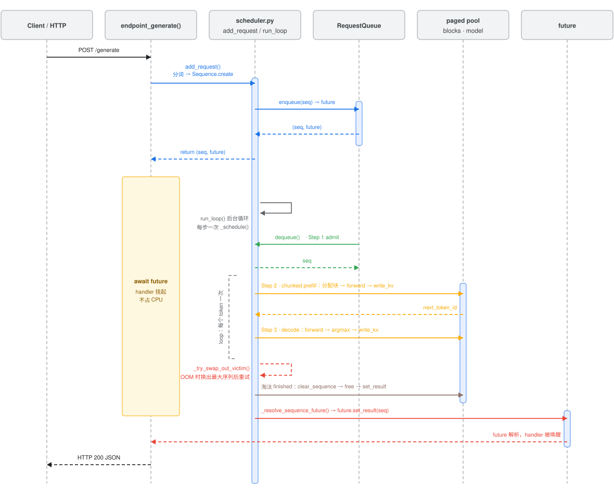
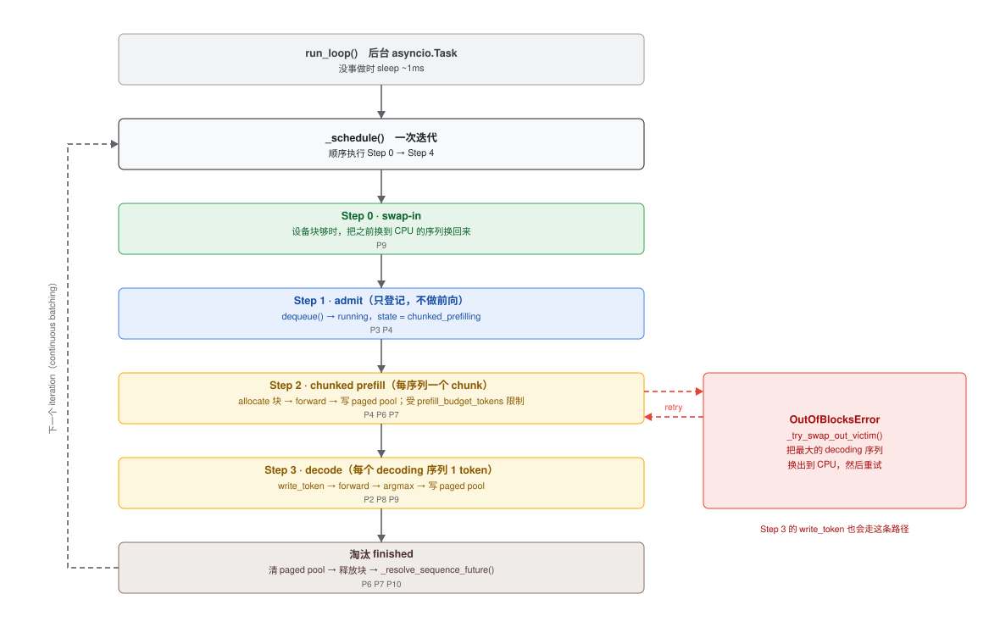

# Phase 2 调度器：一次请求的生命周期

Phase 1（`engine/sequential.py`）是「一个请求从头跑到尾」；Phase 2 把它拆成
**入队（`add_request`）+ 后台循环（`run_loop` 里的 `_schedule`）** 两部分，
用 `asyncio.Future` 把 HTTP handler 和调度器解耦。

> 本文配图是 **drawio 手绘结构图**（`figures/scheduler-*.drawio.svg`），双击即可编辑，
> 约定见 [`0004-figures.md`](0004-figures.md)。
> 断点位置与 VSCode 用法见 [`0002-debugging.md`](0002-debugging.md)。
> Transformer / KV cache 的原理见 [`0005-blog-prefill-decode.md`](0005-blog-prefill-decode.md)。
> Phase 编号对应关系见 [`0010-phase-index.md`](0010-phase-index.md)。

---

## 一、时序图：从 POST 到返回



读图要点：

1. **handler 只做「入队 + 等」**：`add_request()` 分词、建 `Sequence`、丢进
   `RequestQueue`，拿到一个 `future` 后 `await` 它——此时 handler **挂起、不占 CPU**。
2. **真正的计算在后台**：`run_loop` 任务不断调用 `_schedule()`，每个迭代走
   Step 0 → 3。
3. **完成时 future 被解析**：淘汰序列时 `_resolve_sequence_future()` 调
   `future.set_result(seq)`，handler 被唤醒、组装 JSON 返回。
4. **一条序列跨多个迭代**：Step 3 每步只解 1 个 token，所以图下半部分会循环很多次，
   直到命中 `eos_token_id` 或达到 `max_new_tokens`。
5. **OOM 旁路**（红色虚线）：分配块失败时，`_try_swap_out_victim()` 把某个
   decoding 序列换到 CPU，再重试，而不是直接杀掉请求。

---

## 二、`_schedule()` 的一次迭代



| 步骤 | 做什么 | 对应代码 |
| --- | --- | --- |
| Step 0 · swap-in | 设备块够时，把之前换到 CPU 的序列换回来 | `_schedule` 里的 swap-in 循环 |
| Step 1 · admit | 从队列取请求进 `running`（**只登记，不做前向**） | `request_queue.dequeue()` + `mark_admitted()` |
| Step 2 · chunked prefill | 每个 prefill 中的序列推**一个 chunk**，受 `prefill_budget_tokens` 限制 | `_prefill_chunk_blocking()` |
| Step 3 · decode | 每个 decoding 序列解 **1 个 token** | `_decode_step_single()` |
| 淘汰 | 清 paged pool → 释放块 → 解析 future | `_resolve_sequence_future()` |

**为什么 Step 1 只登记、Step 2 才前向？** 这样新请求进入 `running` 后最多只处理
一个 chunk 就轮到别人 decode，避免「一个长 prompt 的 prefill 卡住所有正在 decode 的序列」。
这正是「prefill / decode 分离 + 分块 prefill」的核心动机
（见 [`0005`](0005-blog-prefill-decode.md) §8.4 最后一条；分块细节见
[`0014-prefill-and-chunking.md`](0014-prefill-and-chunking.md)）。

---

## 三、与 Phase 1 的对应关系

| Phase 1（`sequential.py`） | Phase 2（`scheduler.py`） |
| --- | --- |
| `prefill()` 一次算完整段 prompt | `_prefill_chunk_blocking()` 每步一个 chunk |
| `decode()` 内部 `for` 循环 N-1 次 | `_decode_step_single()` 每步执行循环体 1 次 |
| 请求串行（`asyncio.Lock`） | 多序列按 iteration 轮流前进 |
| KV 用 HF `past_key_values` | KV 写进 paged pool，支持换出 |

> 所以理解 Phase 2 最省力的路径是：**先读透 Phase 1 的 `prefill`/`decode`，
> 再把它「拆成一步」塞进 `_schedule`。**

---

## 四、建议断点

| 观察点 | 断点 |
| --- | --- |
| 请求进入系统 | `scheduler.py: add_request` |
| 迭代调度 | `scheduler.py: _schedule` |
| 一个 prefill chunk | `scheduler.py: _prefill_chunk_blocking` |
| 一个 decode step | `scheduler.py: _decode_step_single` |
| 抢占 | `scheduler.py: _try_swap_out_victim` |
| future 解析 | `scheduler.py: _resolve_sequence_future` |

在 `_schedule` 里用 Log Message 断点打印 `running={len(self.running)}`，
连续发几个请求，就能直观看到连续批处理的「进进出出」。

---

## 五、配图怎么改

这两张图是 **drawio 手绘结构图**，源文件就是 markdown 引用的那两个文件本身：

| 图 | 可编辑的源文件 |
| --- | --- |
| 一、时序图 | `figures/scheduler-sequence.drawio.svg` |
| 二、`_schedule()` 迭代 | `figures/scheduler-stages.drawio.svg` |

改图：在 VS Code 里**双击该文件** → 进 draw.io 画布 → `Cmd+S`。
markdown 里那行 `figures/xxx.drawio.svg` 图片引用**不用改**（详见 [`0004-figures.md`](0004-figures.md) §一）。

> 早期用 matplotlib 生成的两个版本（`figures/scheduler_sequence.svg`、
> `figures/scheduler_stages.svg`）已废弃，脚本改名为
> `scripts/legacy_plot_scheduler_*.py`，不再由 `plot_all.py` 调用。
> 废弃原因是文字会互相压字（时序图的 `Step 2` / `OutOfBlocksError` 叠在一起）。

其余**数据图**仍由脚本生成：

```bash
uv run python scripts/plot_all.py
```
