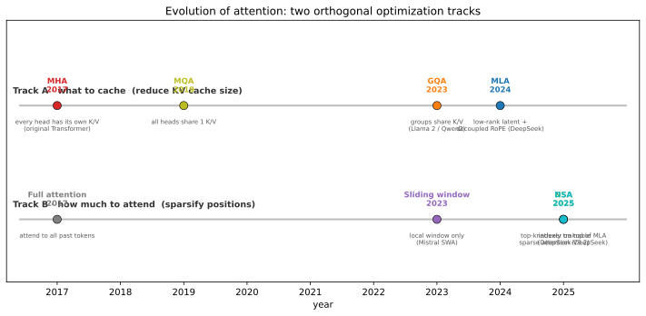

# 注意力机制的演进：从 MHA 到 MLA 与稀疏注意力

> 以原始 Transformer 的 **MHA** 为起点，梳理业界在「让注意力更省」这件事上走过的两条
> 主线。作为本项目的学习文档，落到 Qwen2 / DeepSeek 的真实选择上。
>
> 更广的注意力优化（FlashAttention / PagedAttention / 线性注意力 / 量化注意力）见
> [`0009-attention-landscape.md`](0009-attention-landscape.md)。
>
> 配图由 `scripts/plot_*.py` 生成，约定见 [`0004-figures.md`](0004-figures.md)。

---

## 0. 问题的起点：注意力贵在哪

标准自注意力（原始 Transformer，2017）有两个随序列长度 $n$ 增长的代价：

- **计算量** $O(n^2 d)$：每个位置要和所有位置算相似度；
- **KV cache 内存** $O(n)$：自回归推理时，过去所有 token 的 K、V 都要缓存，
  每 token 每层

$$
\text{KV bytes} = \underbrace{2}_{K,V} \cdot n_h \cdot d_h \cdot b
$$

其中 $n_h$ 是注意力头数，$d_h$ 是头维度，$b$ 是每元素字节数。
长上下文 + 高并发时，KV cache 往往比模型权重还占显存。

于是业界走出**两条正交**的优化路线：

- **Track A · 减少「缓存什么」**：压缩 KV cache 体积 → MQA、GQA、MLA
- **Track B · 减少「看多少」**：稀疏化被注意的位置 → Sliding Window、NSA、DSA

> 图：[`scripts/plot_attention_timeline.py`](../scripts/plot_attention_timeline.py) 生成。

---

## 1. MHA（Multi-Head Attention，2017）

原始 Transformer 的方案：**每个 query 头都有自己独立的 K、V 头**，$n_{kv} = n_h$。

$$
\text{Attn}(Q,K,V) = \mathrm{softmax}\!\left(\frac{QK^\top}{\sqrt{d_h}} + M\right)V
$$

优点：表达力最强。缺点：KV cache 最大——每 token 每层要缓存 $2 n_h d_h$ 个元素。

以 DeepSeek-V2 的规模（$n_h=128, d_h=128$，fp16）为例，每 token 每层就是
$2\times128\times128 = 32768$ 个元素（**64 KB**）。128K 上下文下不可接受。

---

## 2. MQA（Multi-Query Attention，2019）

Shazeer 提出：**所有 query 头共享同一组 K、V**，$n_{kv}=1$。

$$
\text{KV bytes/token/layer} = 2 \cdot d_h
$$

KV cache 降到 MHA 的 $1/n_h$。代价：表达力受限（所有头被迫用同一套键值），
质量通常下降，且训练/推理都需要专门处理。

---

## 3. GQA（Grouped-Query Attention，2023）

折中方案：把 query 头**分组**，每组共享一组 K、V，$1 < n_{kv} < n_h$。

$$
\text{KV bytes/token/layer} = 2 \cdot n_{kv} \cdot d_h
$$

Llama 2 70B、Mistral、**Qwen2** 都用它。Qwen2-0.5B 实测 $n_h=14$、$n_{kv}=2$，
即每 7 个 query 头共享 1 组 K/V。

> 图：[`scripts/plot_gqa_heads.py`](../scripts/plot_gqa_heads.py) 生成。

GQA 可以看作「训练时用 MHA、推理时等价于 MQA 的混合」，在质量与显存之间取得平衡，
是当前最主流的落地选择。

---

## 4. MLA（Multi-head Latent Attention，2024，DeepSeek）

MQA/GQA 是**减少头数**；MLA 换了个维度：**压缩被缓存的内容**。它不再按头缓存 K、V，
而是把每个 token 的 KV 压成一个**低秩隐向量**，用时再投影回去。

对第 $t$ 个 token 的隐状态 $h_t$：

$$
c_t^{KV} = W^{DKV} h_t \in \mathbb{R}^{d_c}
\quad\text{（下投影，只缓存它）}
$$

$$
k_t^{C} = W^{UK} c_t^{KV}, \qquad v_t^{C} = W^{UV} c_t^{KV}
\quad\text{（上投影回每头的 K、V）}
$$

为了让 RoPE 仍然可用，额外加一路**解耦的 RoPE 键**：

$$
k_t^{R} = \mathrm{RoPE}(W^{KR} h_t), \qquad
k_t = [\,k_t^{C};\, k_t^{R}\,], \qquad v_t = v_t^{C}
$$

**真正缓存的只有 $\{c_t^{KV},\ k_t^{R}\}$**，即每 token 每层 $d_c + d_h^{R}$ 个元素。

DeepSeek-V2 取 $d_c=512$、$d_h^{R}=64$，即 576 个元素，而 MHA 要 32768 个，约 **57×**
更小。DeepSeek-V3 / R1 沿用 MLA。

**推理技巧「矩阵吸收」**：因为

$$
q\cdot k^{C} = (W^{Q}h)\cdot(W^{UK}c) = (W^{UK\top}W^{Q}h)\cdot c
$$

可以把 $W^{UK}$ 吸进 $W^{Q}$、把 $W^{UV}$ 吸进 $W^{O}$，于是不必显式物化每头的 K、V——
计算上表现得像 MHA，缓存却小得多。代价是实现复杂，需要自定义 kernel 才高效。

> 图：[`scripts/plot_kv_cache_variants.py`](../scripts/plot_kv_cache_variants.py) 生成（对数轴）。

---

## 5. Track B：稀疏注意力（2023–2025）

前面都在压缩**缓存**；稀疏注意力压缩的是**每个 query 真正参与计算的 key 数量**，
直接砍掉 $O(n^2)$ 的计算。

- **Sliding Window Attention（Mistral，2023）**：每个 token 只看最近 $W$ 个位置
  （局部窗口），远距离信息通过层与层的堆叠间接传播。
- **NSA（Native Sparse Attention，DeepSeek，2025）**：把稀疏性做进训练，且**硬件对齐**
  （分块、可并行），不是事后再稀疏。论文 arXiv:2502.11089。
- **DSA（DeepSeek Sparse Attention，DeepSeek-V3.2，2025）**：**在 MLA 之上**加一个
  「indexer」为每个 query 给候选 key 打分，只保留 top-k 个，并把额外的稀疏掩码
  折进 MLA 的注意力掩码。也就是说 **V3.2 并没有替换掉 MLA，而是在 MLA 的基础上再稀疏化**。

关键认知：**Track A 和 Track B 是正交的，可以叠加**。DSA = MLA（压缩缓存）+ 稀疏（减少计算）。

---

## 6. 总表

| 方案 | 提出 | 核心思路 | 每 token 每层 KV | 主要省什么 |
| --- | --- | --- | --- | --- |
| MHA | 2017 | 每头独立 K/V | $2 n_h d_h$ | 基准 |
| MQA | 2019 | 所有头共享 1 组 | $2 d_h$ | 内存/带宽 |
| GQA | 2023 | 分组共享 | $2 n_{kv} d_h$ | 内存/带宽 |
| MLA | 2024 | 低秩隐向量 + 解耦 RoPE | $d_c + d_h^{R}$ | 内存/带宽（更狠） |
| Sliding Window | 2023 | 只看局部窗口 | 同基础方案 | **计算** |
| NSA | 2025 | 可训练稀疏 + 硬件对齐 | 同基础方案 | **计算** |
| DSA | 2025 | MLA 上叠 top-k indexer | 同 MLA | **计算**（叠在 MLA 上） |

一句话：**Track A 让「缓存更小」，Track B 让「算得更少」**。现代长上下文模型往往两者并用。

---

## 7. 回到本仓库

- 本项目默认模型 **Qwen2-0.5B 用 GQA**（$n_h=14, n_{kv}=2$）+ RoPE；
  KV 相关代码见 [`0005-blog-prefill-decode.md`](0005-blog-prefill-decode.md) 第 4.6 / 5.3 节。
- `engine/kv_cache_config.py` 的 `bytes_per_token` 公式
  `2 · layers · n_kv · head_dim · dtype_bytes` **只适用于 MHA/GQA/MQA**；
  换成 MLA 模型会算错（见 [`0003-code-review-findings.md`](0003-code-review-findings.md) 的 **F26**）。

---

## 参考来源

- Attention Is All You Need（MHA）：`arxiv.org/abs/1706.03762`
- Fast Transformer Decoding（MQA）：`arxiv.org/abs/1911.02150`
- GQA：`arxiv.org/abs/2305.13245`
- DeepSeek-V2（MLA）：`arxiv.org/abs/2405.04434`
- DeepSeek-V3：`arxiv.org/abs/2412.19437`
- Native Sparse Attention（NSA）：`arxiv.org/abs/2502.11089`
- DeepSeek-V3.2（DSA）：见 DeepSeek-V3.2 模型卡与论文
- Sebastian Raschka, *Visual Attention Variants*（综述性博客，非同行评审）

> ⚠️ 各方案的压缩比与质量影响随配置变化，文中倍数为量级示意，不是普适常数；
> 部分来源为博客/预印本，引用时请以原始论文为准。
