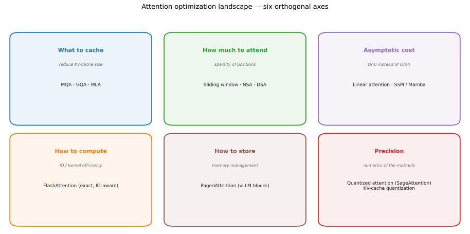
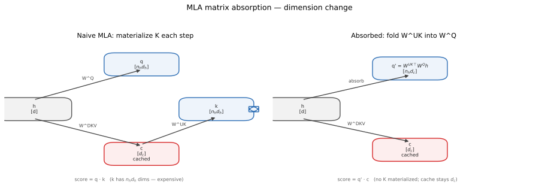

# 注意力优化全景：六个正交维度

> 市面上「Linear Attention / PagedAttention / FlashAttention / 量化注意力」这些词看起来都在谈
> 「注意力」，但它们解决的其实是**完全不同的问题**。把它们放进六个正交维度里，就不容易混了。
>
> 前三条（缓存、稀疏、复杂度）在 [`0008-attention-variants.md`](0008-attention-variants.md)
> 已有展开，本文补齐后三条，并给出全景。



> 图：[`scripts/plot_attention_landscape.py`](../scripts/plot_attention_landscape.py) 生成。

---

## 0. 先立坐标轴

| 维度 | 优化目标 | 代表方法 | 是否改变数学结果 |
| --- | --- | --- | --- |
| 缓存什么 | KV cache 体积 | MQA · GQA · MLA | 是（近似/结构改变） |
| 看多少 | 被注意的位置数 | Sliding window · NSA · DSA | 是（近似） |
| 渐近复杂度 | $O(n^2)\to O(n)$ | Linear attention · SSM | 是（近似） |
| 怎么算 | IO / kernel 效率 | **FlashAttention** | **否（精确）** |
| 怎么存 | 显存管理与碎片 | **PagedAttention** | **否（不动数学）** |
| 精度 | 矩阵乘的数值精度 | **量化注意力（SageAttention）**、KV 量化 | 是（近似） |

**最容易搞混的一点**：FlashAttention 和 PagedAttention **都不改变注意力的数学结果**——
前者是「怎么算得更快」，后者是「KV 怎么存得更省、更不碎」。而 MQA/GQA/MLA、稀疏、线性、
量化都会改变（近似）结果。

---

## 1. 减少「缓存什么」：MQA / GQA / MLA

详见 [`0008-attention-variants.md`](0008-attention-variants.md)。一句话回顾：

- MQA：所有头共享 1 组 K/V；GQA：分组共享（Qwen2：$n_{kv}=2$）；
- MLA：把 KV 压成低秩隐向量 $c_t^{KV}$ + 解耦 RoPE 键，缓存从每头 $2d_h$ 降到 $d_c + d_h^{R}$。

### 1.1 MLA 的「矩阵吸收」到底变了什么维度

MLA 朴素实现每步都要把缓存的 $c_t$ **上投影**回每头 K（$n_h d_h$ 维），很贵。利用结合律可以把
上投影矩阵 $W^{UK}$ **折进** $W^{Q}$：

$$
q\cdot k^{C}
= (W^{Q}h)\cdot(W^{UK}c)
= \big(W^{UK\top}W^{Q}h\big)\cdot c
= q'\cdot c
$$

于是「先 up-project 再点积」变成「对 q 换个投影后，直接和缓存的 $c$ 点积」——**K 不再被物化**。



> 图：[`scripts/plot_mla_absorption.py`](../scripts/plot_mla_absorption.py) 生成。左边朴素版每步要
> 物化 $n_h d_h$ 维的 K；右边吸收后只缓存 $d_c$ 维的 $c$，把 $W^{UK}$ 折进 $W^Q$。同理
> $W^{UV}$ 可折进 $W^O$。这就是 MLA 在推理时「像 MHA 一样算、但缓存小得多」的原因。

---

## 2. 减少「看多少」：稀疏注意力

Sliding window（Mistral）、NSA（DeepSeek，arXiv 2502.11089）、DSA（DeepSeek-V3.2，叠在 MLA 上）。
它们减少每个 query 真正参与计算的 key 数量，直接砍计算。详见 0008 第 5 节。

---

## 3. 改变「渐近复杂度」：线性注意力

Softmax 注意力对每个 query 要和**所有** key 算相似度，$O(n^2)$。线性注意力换掉 softmax，
用特征映射 $\varphi(\cdot)$ 把相似度写成可结合的核：

$$
\mathrm{Attn}_i
= \frac{\sum_{j} \varphi(q_i)^\top \varphi(k_j)\, v_j}
       {\sum_{j} \varphi(q_i)^\top \varphi(k_j)}
= \frac{\varphi(q_i)^\top \Big(\sum_j \varphi(k_j) v_j^\top\Big)}
       {\varphi(q_i)^\top \Big(\sum_j \varphi(k_j)\Big)}
$$

关键是**先算求和**（与 $i$ 无关），再和每个 query 相乘：

$$
S = \sum_j \varphi(k_j)\, v_j^\top \in \mathbb{R}^{d\times d},\qquad
z = \sum_j \varphi(k_j) \in \mathbb{R}^{d}
$$

复杂度从 $O(n^2 d)$ 降到 $O(n d^2)$；当 $n \gg d$ 时是线性增长。

更妙的是它可以写成**递推**（Katharopoulos 等，*Transformers are RNNs*，2020）：

$$
S_t = S_{t-1} + \varphi(k_t)\, v_t^\top,\qquad
\mathrm{out}_t = \frac{\varphi(q_t)^\top S_t}{\varphi(q_t)^\top z_t}
$$

即每步只更新一个 $d\times d$ 的「状态」，**推理时不需要 KV cache，显存与序列长度无关**。
代价：它是对 softmax 注意力的**近似**，在需要精确检索（recall）的任务上可能变差；因此
近年多以**混合架构**出现（如 RWKV、RetNet、Mamba/SSM，以及把线性层与注意力层交替堆叠的
Qwen3-Next 等）。

> 一句话：Track「稀疏」是少看几个；Track「线性」是把**看的顺序**换掉，让计算可结合。

---

## 4. 怎么算得更快：FlashAttention

FlashAttention（Dao 等，NeurIPS 2022）**不改变数学结果**，是**精确注意力**。它做的是
**IO-aware**：GPU 的 SRAM（快、小）和 HBM（慢、大）之间有带宽瓶颈，标准实现会把
$n\times n$ 的注意力矩阵写回 HBM，浪费带宽。

FlashAttention 把 Q、K、V **分块（tiling）**，在 SRAM 里做完 softmax（用 online softmax）
再写回，**从不物化整个 $n\times n$ 矩阵**。结果是：

- 显存从 $O(n^2)$ 降到 $O(n)$；
- 速度提升数倍（FA-2 进一步优化并行与调度，FA-3 面向 Hopper）。

**它和前面几条是正交的**：无论你用 MHA/GQA/MLA、稀疏还是线性，都能再用 FlashAttention 式的
kernel 来加速「怎么算」。

---

## 5. 怎么存得更好：PagedAttention（vLLM）

PagedAttention **不是一种新的注意力数学**，而是 **KV cache 的显存管理**方案。灵感来自操作系统的
虚拟内存分页：

- 把每条序列的 KV cache 切成固定大小的 **block**；
- 用一张 **block table** 把「逻辑块号」映射到「物理块号」；
- 物理块可以离散分布在显存里，按需分配、用完归还。

收益：

- **几乎无碎片**：不再按 max_seq_len 预留连续空间；
- **可共享**：相同前缀的序列可共享 block（prefix caching）、beam search 用 copy-on-write；
- 于是**能把 batch 做得很大**，vLLM 借此报告了相对 HuggingFace 数十倍的吞吐（作者口径）。

> **注意**：PagedAttention 需要配套一个「按 block table 聚合 KV」的自定义 kernel，
> 但注意力本身的数学定义没变。

**本仓库的对应**：`engine/block_allocator.py` + `engine/paged_kv_cache.py` 就是它的简化版——
`block_size=16`、block table、swap-out/in。可以直接对照阅读，见
[`0001-learning-roadmap.md`](0001-learning-roadmap.md) 的核心链路。

---

## 6. 降低精度：量化注意力 / KV 量化

你记得的「量化注意力超越所有注意力速度」，大概率指 **SageAttention** 这一类：把注意力里的
矩阵乘降到 8-bit（$QK^\top$ 用 INT8、$PV$ 用 FP8），作者报告相对 FlashAttention **2–5× 加速**
且端到端指标基本无损（ICLR/ICML/NeurIPS 系列，**属作者口径，未独立复现**）。

直觉：注意力和线性层一样是矩阵乘，**降低每元素位宽 = 减少要搬运的字节 = 直接提速**，对
memory-bound 的 decode 尤其有效。同类还有：

- **FP8 attention**（Hopper 原生支持）；
- **KV cache 量化**（INT8/INT4，配合 per-block scale），直接缩小第 5 节里的 block 体积。

代价是数值精度与质量，需要处理离群值（outlier）和缩放因子。

---

## 7. 这些能做到一起吗？——能，而且是正交叠加

一个现代长上下文模型可能同时是：

```
MLA（缓存小） + DSA（稀疏，少算） + FlashAttention 式 kernel（IO 高效）
              + PagedAttention（显存管理）+ 量化（低精度）+ 线性层（混合架构）
```

它们分别作用在**不同的维度和不同的层次**（算法 / kernel / 显存管理 / 数值），互不排斥。
以 DeepSeek-V3.2 为例：**MLA（Track A）+ DSA（Track B）** 就是一次叠加。

---

## 8. 回到本仓库

- `engine/block_allocator.py` + `engine/paged_kv_cache.py` ≈ **PagedAttention 的简化版**（块表 + 逻辑/物理映射）。
- 前向里用的是 HuggingFace 的注意力实现（可能走 SDPA / FlashAttention，取决于环境），本项目**未做**自定义 kernel。
- **未实现**：线性注意力、量化注意力、真正的 paged-attention kernel（本项目是「写进池子」，热路径仍用 live cache，见 findings 的 F3）。
- `engine/kv_cache_config.py` 的 KV 估算公式只适用 MHA/GQA/MQA，**不适用 MLA**（findings 的 F26）。

---

## 参考来源

- Linear attention / Transformers are RNNs：`proceedings.mlr.press/v119/katharopoulos20a`
- FlashAttention：NeurIPS 2022（Dao 等）；`arxiv.org/abs/2205.14135`
- PagedAttention / vLLM：`arxiv.org/abs/2309.06180`；vLLM 设计文档
- SageAttention：`arxiv.org/abs/2410.02367`；`github.com/thu-ml/sageattention`
- MQA / GQA / MLA / NSA / DSA：见 [`0008-attention-variants.md`](0008-attention-variants.md) 的参考来源

> ⚠️ 文中加速倍数为各论文/仓库的作者口径，随硬件与配置变化，未独立复现；引用时以原始论文为准。
