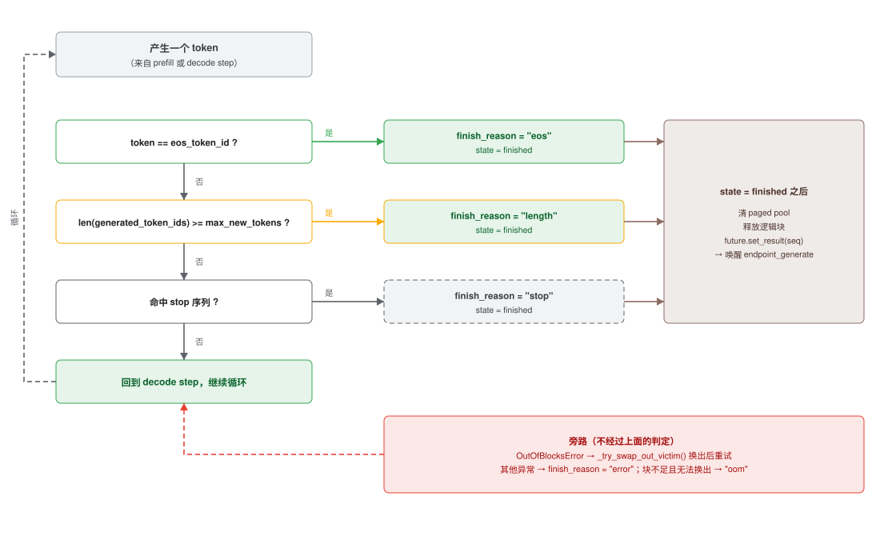
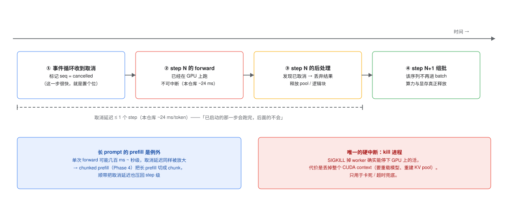

# 生成什么时候停：停止条件、`finish_reason` 与「取消」的真实代价

这篇文档回答一串连在一起的问题：

1. `max_new_tokens` 是怎么控制生成的？它会不会下传到 Transformer 里？
2. 如果一句话需要 250 token 而上限是 200，为什么会返回半句话？
3. 那 GPT / Claude 这些服务为什么几乎感觉不到截断？是靠微调吗？语义完整有保证吗？
4. 用户点了「停止」/ 断开连接，正在跑的 GPU 运算**真的会停下来吗**？
5. 工业界实际怎么做？harness 能管到 GPU kernel 层吗？
6. 「帮我证明哥德巴赫猜想」这种超长任务怎么办？

> 相关：[`0005-blog-prefill-decode.md`](0005-blog-prefill-decode.md)（prefill/decode 原理）、
> [`0006-scheduler-lifecycle.md`](0006-scheduler-lifecycle.md)（调度器与 future）、
> [`0003-code-review-findings.md`](0003-code-review-findings.md)（F19/F20 是本仓库的对应缺口）。

---

## 0. 一页速查

| 机制 | 在哪一层生效 | 谁决定 | 粒度 | 本仓库 |
| --- | --- | --- | --- | --- |
| **EOS** | decode 循环，每步之后 | **模型自己**（学出来的） | 1 token | ✅ `scheduler.py:1072` |
| **`max_new_tokens`** | decode 循环的迭代上界 | 调用方 | 1 token | ✅ |
| **`stop` 字符串 / stop ids** | decode 循环，每步之后 | 调用方 | 1 token | ❌ 见 §8 |
| **上下文窗口** `max_position_embeddings` | 应由引擎预检 | 模型规格 | 请求级 | ❌ **缺失** |
| **取消 / 断连** | scheduler step 边界 | 客户端 | **1 个 step** | ⚠️ 只对排队中的有效（F20） |
| **超时 / 限流** | 网关 | 运维 | 请求级 | ❌ |
| **kill 进程** | 编排层 | 运维 | 进程级 | ❌（也是唯一能中断内核的手段） |

一句话：**除了「杀进程」，没有任何一层能中断正在执行的 GPU kernel。**
所有"取消"都是协作式的，最快在**下一个 step 边界**生效。

---

## 1. `max_new_tokens` 从来没进过 Transformer

先看代码证据。`self.model(...)` 在 `scheduler.py` 里只有两个调用点，实参只有三个：

```python
# scheduler.py:839   prefill
outputs = self.model(input_ids=input_ids, past_key_values=past_kv, use_cache=True)

# scheduler.py:1029   decode
outputs = self.model(input_ids=input_ids, past_key_values=past_kv, use_cache=True)
```

`max_new_tokens` 的全部出现位置都在**循环控制、`Sequence` 字段、HTTP 校验**里，
一次都没进 forward。

原因不是"实现偷懒"，而是**数学上没地方放**。Transformer 每一步只回答一个问题：

$$
P(\text{next token} \mid \text{prefix})
$$

它是**前缀的纯函数**。`200` 这个数字不在任何输入里，模型无从知晓，也就不可能
"知道要写 200 字所以压缩一下"。它唯一能"感知"预算的方式，是**循环不再调它了**。

> 所以「Transformer 有意识、会自动压缩内容」这种设计不存在。想让它说得简短，
> 只能靠 **prompt**（在第一步就改变分布）、**训练**（改变分布本身），
> 而**不能**靠 `max_new_tokens`。

---

## 2. 控制在哪里：外层循环 + **生成之后**判断

### Phase 1（`sequential.py:304`）—— 循环上界

```python
for step in range(max_new_tokens - 1):   # -1 因为第一个 token 已在 prefill 产出
    outputs = model(input_ids=current_token, past_key_values=past_key_values, ...)
    next_token_id = int(logits[:, -1, :].argmax(dim=-1).item())
    generated_ids.append(next_token_id)
    if eos_token_id is not None and next_token_id == eos_token_id:
        break                             # 唯一的提前退出
```

### Phase 2（`-782`）—— 判断挪到"每步一次"

```python
seq.generated_token_ids.append(next_token_id)      # ① 先 append
...
eos_hit    = eos_id is not None and next_token_id == eos_id
length_hit = len(seq.generated_token_ids) >= seq.max_new_tokens
if eos_hit:
    seq.finish_reason = "eos";    seq.state = "finished"
elif length_hit:                                   # ② 注意是 elif
    seq.finish_reason = "length"; seq.state = "finished"
```

两个容易忽略的细节：

1. **先 append 再判断** → `max_new_tokens=200` 是真的"生成满 200 个"才停。
2. **`if eos` / `elif length`** → 同一步两个条件都满足时记 `"eos"`，EOS 优先。
   （`_record_first_token`（`scheduler.py:601`）处理 prefill 产出的第一个 token，
   逻辑同构 —— 因为它也可能直接是 EOS，或 `max_new_tokens=1`。）

`finish_reason` 的完整取值（`sequence.py:138`）：`"eos"` / `"length"` / `"oom"` /
`"error"` / `""`（进行中），并通过 `/generate` 的响应返回（`app_v2.py:184`）。



---

## 3. 那"话说完"到底靠什么？—— EOS，不是 `max_new_tokens`

真正的"我知道我说完了"机制是 **EOS token**：

- 模型在训练数据里见过无数以文档结尾结束的序列，于是学到了"话说完时该吐
  `<|endoftext|>`"。
- 但这个 token **和别的 token 没有任何区别** —— 它也是从 logits 里 argmax 出来的，
  只是概率恰好最高。
- 所以它是**概率性的**：模型"觉得"说完了就说完了 —— 可能说早了，也可能一直不说。

**`max_new_tokens` 的角色是保险丝 / 成本闸门，不是主要停止机制。**

用「需要 250 token，上限 200」对一遍：

| 情况 | 输出 | `finish_reason` |
| --- | --- | --- |
| 模型在第 180 个 token 自然说了 EOS | 完整 | `"eos"` ✅ |
| 模型确实要 250 个才说完 | **第 200 个 token 后截断**，半句话 | `"length"` ⚠️ |

第二种情况**确实会返回不完整内容**。这不是 bug，是设计。所以 `finish_reason`
不是可选的调试字段，而是**调用方必须处理的契约**：

- 看到 `"length"` → 加大预算重试，或**续写**（把已生成部分当作新 prompt 的前缀
  再生成一段拼接 —— 这就是 "Continue" 按钮的原理）。
- 看到 `"eos"` → 模型认为自己说完了。

⚠️ 但**不能指望模型"续写得紧凑一点"**：它没有前瞻，每步只能按概率选下一个 token，
不知道后面还有多少内容要讲。

---

## 4. 为什么用 GPT / Claude 时几乎感觉不到截断

**不是"他们不截断"，而是四件事叠加，把撞上限的概率压得很低。**

### ① 默认预算很大

不填 `max_completion_tokens` / `max_output_tokens` 时，服务端用的是**模型的输出上限**
（量级是几千到几万 token），而不是一个随手定的小数字。本仓库默认 `50`
（`config.py:47`）才是异常小的那个。

> 顺带一个容易踩的坑：**推理模型（o 系列等）的思考 token 也计入预算**，
> 而且计费但不返回。所以给推理模型留的 `max_completion_tokens` 必须包含思考开销。

### ② `stop` 与 chat template

Instruct 模型套了对话模板，模板**自带 stop token**（如 `<|im_end|>`、`<|eot_id|>`）。
模型被训练在这些边界收尾，服务端把它们登记为停止序列。这一层让"轮到我该停了"
变得非常可靠 —— 比裸 EOS 可靠得多。

### ③ 微调 / RLHF 教的「该收尾就收尾」

后训练会显著提高"在自然结束处输出停止 token"的概率。**但这不构成语义完整性的保证**：

> EOS 只是分布上的一个 token，训练只是把这个概率调高，
> **没有任何形式化约束**保证"文本语义上完整了才输出 EOS"。

所以工程上的答案不是"追求语义完整"，而是**把"没说完"变成可检测信号**
（`finish_reason`）+ **外面套循环去续写/校验**（见 §6）。

### ④ 应用层兜底

- `finish_reason == "length"` → 重试或续写；
- 有 **streaming** 时，即使用户中途停，至少已经拿到前面部分（本仓库无 streaming，F19）。

---

## 5. 取消：能不能把正在跑的 GPU 运算掐掉？

**不能。** 三层原因，从下往上：

### ① 硬件/驱动层没有「中止已启动 kernel」的原语

- CUDA 只提供**协作式取消**：kernel 自己轮询一个全局内存 flag，发现置位就提前退出
  —— 这要求 kernel 是你写的、且每个线程都会去检查。
- 在 kernel 内部，`asm("trap;")` 能让所有线程中止并向 host 报 launch failure，
  `asm("exit;")` 只结束当前线程。这是 **kernel 自杀**，不是 host 遥控。
- Pascal 及更新架构的 *Compute Preemption* 是**驱动为了在多个上下文之间切换**
  （支持 Ctrl-C、多进程共存）而做的抢占，**不是给应用调用的"取消我自己的 kernel"API**。
- CUDA C++ Programming Guide 里没有 host 侧取消运行中 kernel 的接口。

> 证据强度说明：这条结论来自 CUDA 文档 + NVIDIA 开发者论坛的一致说法
> （[SO: How to interrupt or cancel a CUDA kernel](https://stackoverflow.com/questions/34989481/how-to-interrupt-or-cancel-a-cuda-kernel-from-host-code)、
> NVIDIA 开发者论坛关于 Compute Preemption 的多个帖子）。论坛帖不是权威规范，
> 但"没有 host 侧取消 API"这一点在所有来源里一致。

### ② 粒度问题：一次 forward 是一个大 kernel

一次 decode forward 是几十毫秒量级、一次 prefill forward 可能几百毫秒到秒级。
要中断它，你得抢在 SM 执行到一半时停下 —— 也就是上面说的做不到的事。

### ③ 唯一的硬中断是杀进程

`SIGKILL` 掉 worker 进程确实能停下 GPU 上的活（驱动会回收上下文），代价是丢掉
整个 CUDA context：要重新加载模型、重建 KV pool。所以它只用于**卡死/超时**的兜底。

### 于是工业界一致采用：协作式取消 + **step 边界**检查

```
每个 scheduler step：
  1. 检查取消标记 / abort 列表          ← 取消在这里"登记"
  2. 组 batch（把已取消的排除掉）
  3. forward（不可中断，几十 ms）        ← 已启动的这一步只能跑完
  4. 后处理；已取消的序列在这里被丢弃     ← 取消在这里"生效"
```

- **取消延迟 ≤ 1 个 step**（本仓库 ~24 ms/token，同类引擎同一量级）。
- 正在跑的那一次 forward **会跑完**，结果被丢掉 —— 算力白烧一个 step，但**仅此而已**，
  不会继续烧后面的 step。

所以对「是不是等它跑完但不返回给用户」这个猜测，准确的回答是：
**已经启动的那一步会跑完（几十毫秒），剩下的步不会。** 不是"整个请求跑完"。

- 例外是**长 prompt 的 prefill**：一次 forward 可能几百 ms 甚至秒级。
  这正是 **chunked prefill**（本仓库 Phase 4）的额外价值 —— 它把取消延迟一起限住了。
- vLLM 也是同一思路：`abort_requests` 在调度层生效，官方描述是 abort 可以
  "without pausing the scheduler"（即只影响后续 step 的组批）。



---

## 6. 本仓库的取消实现，以及它停在哪一步

`app_v2.py:232-236`：

```python
except asyncio.CancelledError:
    # [GOTCHA] 客户端断开时只能取消"还在排队"的请求；已经 admit 进 running 的
    #         序列，cancel() 返回 False，生成会继续跑完（README 列为后续改进点）。
    await _scheduler.request_queue.cancel(seq.seq_id)
    raise
```

而 `RequestQueue.cancel()` 会**主动拒绝**取消已在运行的序列（`request_queue.py:294`）：

```python
if item.sequence.state not in ("expired", "cancelled", "decoding", "finished"):
```

结果是：**已 admit 的序列会跑完**，`_resolve_sequence_future()` 照常 `set_result`，
但已经没人读这个 future 了 —— 算力与显存白烧。这就是 **F20**。

> ⚠️ 另一个现实的坑：**ASGI 层的断线检测本身是版本相关的**。
> Starlette / uvicorn 关于"客户端断开是否取消 handler task"的行为改过多次
> （见 Starlette discussion #2866、#3004、issue #1438），所以不能假定
> `CancelledError` 一定会被抛出。生产环境的取消应该**在引擎内部显式实现**
> （维护一个 abort id 集合，由 step 边界消费），而不是依赖 ASGI 框架的行为。

这恰好也是 vLLM 的做法：取消是**引擎的一个显式 API**（abort），而不是依赖 HTTP 层。

---

## 7. 「帮我证明哥德巴赫猜想」这种超长任务怎么办

关键认识：**harness 也管不到 GPU kernel。它管的是「要不要发下一次请求」。**

- **单次 API 调用永远是有限预算**：`max_output_tokens` 有上限（几百到几万 token），
  所以不存在"一次调用无限跑下去"。这是第一道闸。
- **真正超长的是 agent / harness 的多轮**：每轮一次（或多次）API 调用，
  harness 在**轮与轮之间**做事。
- harness 能做的三件事（**全部在 kernel 之外**）：
  1. **决定不再发下一次请求** —— 最有效、也是唯一真正"叫停"的地方；
  2. 挂断 HTTP 连接 → 服务端在下一个 step 边界丢弃（§5）；
  3. 收紧参数：`max_output_tokens`、thinking / reasoning budget、stop 序列。
- harness **做不到**的：让正在跑的 matmul 停下来。

所以对"证明哥德巴赫"这类任务，工程上的答案是：
**能力上限 + 预算上限 + 尽早失败 + 可观测**，而不是"中断 GPU"。

一个具体的判据是：**任何单步都要能用"有限预算 + 有限时间"封顶**。
如果你的 harness 允许"无限轮次 + 无限单次输出"，那问题不在 GPU，在预算设计。

---

## 8. 工业界实际怎么组合这些手段

| 层 | 手段 | 生效粒度 | 代价 |
| --- | --- | --- | --- |
| 客户端 | streaming + 用户点"停止" → 断连 | 下一个 chunk | 已生成部分浪费 |
| 网关 | 超时、限流、请求 ID 追踪 | 请求级 | 需要额外基础设施 |
| **引擎** | **abort 集合 + step 边界丢弃** | **≤ 1 个 step** | 一个 step 的算力 |
| 引擎 | **chunked prefill** | 把长 prefill 的取消延迟也压到 step 级 | 需要分块预填充实现 |
| 引擎 | **抢占（preemption）** | step 级 | 让路而非杀掉：swap out 到 CPU（本仓库 Phase 9 就是这种"软抢占"） |
| 编排 | 健康检查 + `kill` + 重启 | 进程级 | 丢 CUDA context，重启慢（唯一能对付卡死 kernel 的手段） |

一句话总结这套设计哲学：**上层负责"不要再做了"，而不是"停下来"。**

---

## 9. TODO（本文相关的仓库缺口）

- [ ] **`stop` 字符串支持**（对应 F27）：`GenerateRequest` 加 `stop: list[str]`；
      实现上需要每步把新 token 反解码、在尾部做字符串匹配（要限制回看窗口，
      否则每步反解码整段输出会成为瓶颈）。`finish_reason` 增加 `"stop"`。
      —— **本次不改，仅记录。**
- [ ] **上下文窗口检查**（对应 F28）：`prompt_tokens + max_new_tokens <=`
      模型 `max_position_embeddings`。目前引擎完全没有这个检查，长 prompt +
      大预算会越过位置上限。（注意 `kv_num_blocks` 管的是**显存**，不是**位置**。）
- [ ] **`min_new_tokens`**：强制至少生成 N 个，防开场就 EOS（对压测和确定性测试有用）。
- [ ] **`ignore_eos`**：压测时强制跑满，测真实吞吐上限；现在测吞吐会被提前 EOS 干扰。
- [ ] **取消已 admit 的序列**（F20）：引擎内维护 abort id 集合，在 `_schedule` 的
      Step 1/4 消费；不要依赖 ASGI 的断线行为。
- [ ] **streaming**（F19）：用户"取消"体验的前提 —— 没有增量输出时，
      "取消"只能省服务端算力，用户侧什么也拿不到。

---

## 附：怎么用一句话判断某个行为属于哪一层

| 你想做的事 | 该在哪一层做 | 能做吗 |
| --- | --- | --- |
| 让模型说得短一点 | Prompt / 训练 | ✅（改变分布） |
| 让生成别超过 N 个 token | decode 循环 | ✅（硬切，会截断） |
| 遇到某个词就停 | decode 循环（`stop`） | ✅（本仓库未实现） |
| 用户点停止后别再算了 | engine step 边界 | ✅（≤1 step 延迟） |
| 让正在跑的 matmul 立刻停 | —— | ❌ 不存在这种原语 |
| 卡死了要救回来 | 编排层 kill 进程 | ✅（唯一手段） |
