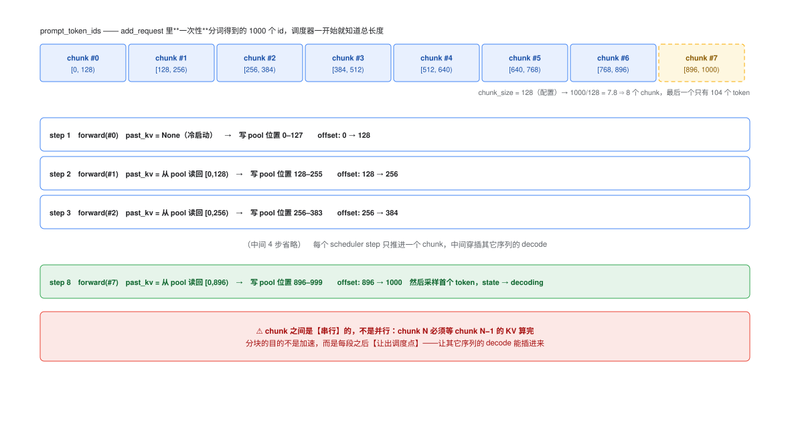
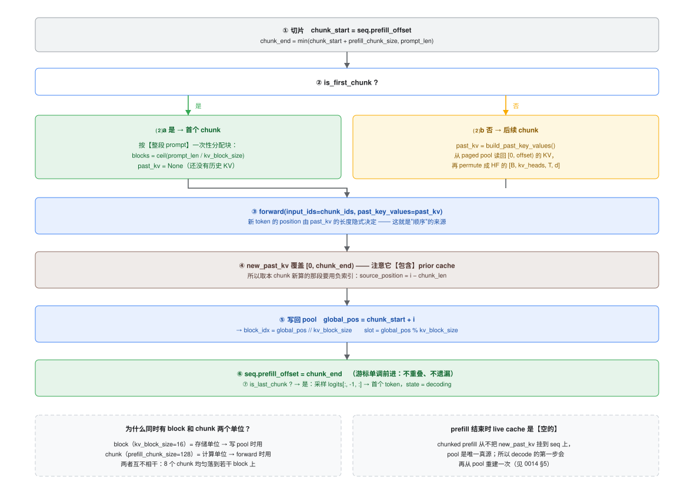
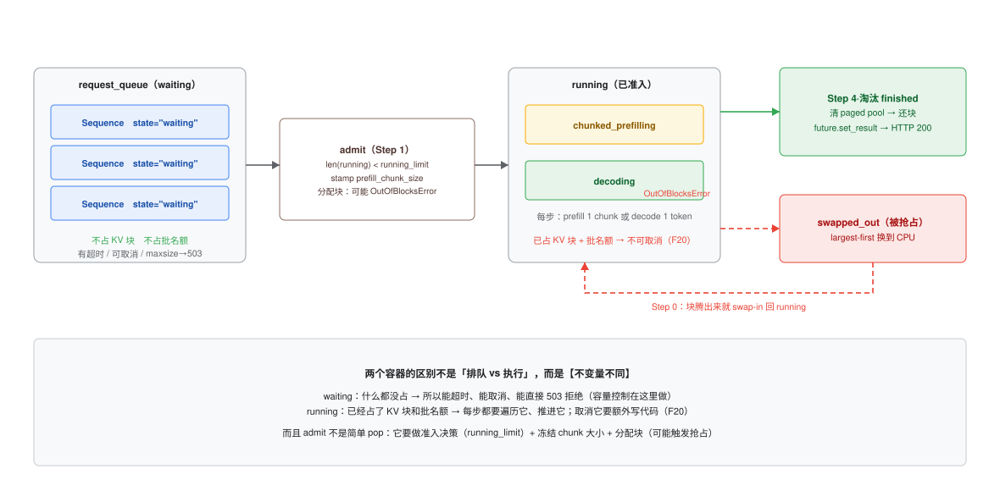

# 分块 prefill 详解：prompt 怎么被切开、算完、再拼起来

这篇文档回答一串集中在 `_schedule()` Step 2 和 `_prefill_chunk_blocking()` 的问题：

1. **prefill 为什么能拆成块？** 分词得到 1000 个 id，是按 200 个一组切吗？
2. 切开之后**并行算还是串行算**？顺序靠什么保证？有 offset 吗？
3. `prefill_chunk_size` 和 `prefill_budget_tokens` 是什么取舍？decode 侧有对应的东西吗？
4. `prefill_offset` 到底怎么起作用？
5. `block` 和 `chunk` 是两个东西吗？**KV cache 在这里怎么体现**？
6. 为什么要有 `request_queue` + `running` **两套容器**？一个 queue 不行吗？
7. `swapped_out` 那个 for 循环（Step 0）是什么？**抢占**有什么用？

> 相关：[`0006-scheduler-lifecycle.md`](0006-scheduler-lifecycle.md)（调度器时序图）、
> [`0007-phase2-guide.md`](0007-phase2-guide.md)（Phase 2 实验清单）、
> [`0005-blog-prefill-decode.md`](0005-blog-prefill-decode.md) §8.4（compute-bound vs memory-bound）、
> [`0010-phase-index.md`](0010-phase-index.md)（Phase ↔ 代码位置）。

---

## 0. 一页速查

| 问题 | 答案 |
| --- | --- |
| 为什么能切 | **分词是一次性做完的**（`add_request` 里），调度器一上来就知道 `prompt_len`；切的是"喂进 forward 的 `input_ids`"，不是 tokenizer 的输出 |
| 按多少切 | `prefill_chunk_size = 128`（**计算**单位），1000 个 id → 8 个 chunk |
| 串行还是并行 | **串行**！chunk N 依赖 chunk N−1 的 KV。分块的目的**不是加速**，而是"每段之后让出调度点" |
| 顺序靠什么保证 | 三处必须一致：① `prefill_offset`（调度器游标）② `past_kv` 长度（模型推出 position）③ `global_pos`（写 pool 的位置） |
| 有 offset 吗 | 有，而且有**三个**：`prefill_offset` / KV 长度 / `global_pos` |
| `block` vs `chunk` | block=16 是**存储**单位（写 pool），chunk=128 是**计算**单位（forward），两者无关 |
| 两套容器 | `waiting` **什么都没占**（可超时/取消/503）；`running` **已占 KV 块 + 批名额**（不可取消，F20） |
| 抢占干什么 | 不杀请求：块不够时把"占块最多"的 decoding 序列换到 CPU，腾出设备显存接纳新序列 |

---

## 1. 为什么 prefill 能切

### 1.1 关键前提：分词在 `add_request` 里一次做完

```python
# scheduler.py  add_request()
prompt_token_ids = await loop.run_in_executor(
    self._executor,
    lambda: self.tokenizer(prompt, add_special_tokens=True)["input_ids"],
)
seq = Sequence.create(prompt=prompt, prompt_token_ids=list(prompt_token_ids), ...)
```

**这一步之后，整段 prompt 的 token id 列表就已经完整存在了。** 所以调度器在
接纳请求的那一刻就知道 `prompt_len`，可以任意决定"这次先算前 128 个"。

> 所以要回答"为什么到 tokenizer 这一步就能拆"：**拆分不是 tokenizer 的行为，
> 而是调度器对 tokenizer 输出的切片。** `tokenizer` 永远是一次算完整段。

### 1.2 数学前提：causal attention 让"前缀"是自洽的

第 $i$ 个 token 的注意力只依赖 $[0, i]$。所以：

- 按**前缀顺序**切成任意段都是合法的：先算 $[0,128)$，再算 $[128,256)$ ……
- 但**不能乱序**：算 $[128,256)$ 之前必须有 $[0,128)$ 的 KV。
- **段的边界不必对齐 block**：`chunk` 和 `block` 是两个不相干的单位（见 §2）。

### 1.3 一个反直觉的结论：分块不是为了加速

```
chunk N 的 forward 需要 past_kv = KV([0, offset))
                              ↑ 这来自 chunk N−1 刚写进 pool 的东西
```

**这是严格的串行依赖链。** 分块 prefill（chunked prefill）的收益是：

| | 整段 prefill | 分块 prefill |
| --- | --- | --- |
| forward 次数 | 1 | 8 |
| 总计算量 | 相同（甚至略多，因为要重复读 KV） | 相同 |
| **单次阻塞时长** | 1000 token 的 forward | 128 token 的 forward |
| **对其它序列 decode 的影响** | **全程阻塞** | 每 128 token 让出一次 |

所以它的价值是**降低尾延迟（P99）**：让一个长 prompt 不至于把正在 decode 的序列饿死。
`config.py` 的注释写得很直接：

```python
# Number of prompt tokens processed per scheduler step during chunked
# prefill.  Smaller values give more decode interleaving (lower P99 for
# concurrent short requests) at the cost of more forward passes per long prompt.
prefill_chunk_size: int = 128
```



---

## 2. `block` 和 `chunk` 是两个不同的单位

这是最容易混的一点：

| | `chunk` | `block` |
| --- | --- | --- |
| 配置项 | `prefill_chunk_size = 128` | `kv_block_size = 16` |
| 是什么的单位 | **计算**：一次 forward 喂多少 token | **存储**：KV pool 的一次分配粒度 |
| 谁用它 | `_prefill_chunk_blocking` 切片 | `block_allocator` / `paged_kv_cache.write_kv` |
| 1000 token 时 | 切成 **8** 段 | 占 **⌈1000/16⌉ = 63** 个块 |

### 为什么 `chunk_size` 和 `block_size` 不设成同一个值？

因为它们回答的是**两个不同的问题**，最优值由**不同的东西**决定：

| | `kv_block_size = 16` | `prefill_chunk_size = 128` |
| --- | --- | --- |
| 回答的问题 | 每次**分配/寻址 KV 内存**的单位多大？ | 一次 forward 算多少 token 就**让出调度**？ |
| 属于 | **内存管理**问题 | **延迟 / 调度**问题 |
| 调小的收益 | 内部碎片少、浪费少 | decode 交错更频繁、P99 更好 |
| 调小的代价 | block table 项数↑、查找开销↑ | forward 次数↑、每 chunk 固定开销摊不开 |
| 由什么决定 | 显存/寻址效率（**在 vLLM 里还被 PagedAttention kernel 钉死**） | 你的**延迟目标** + 负载里 prefill:decode 的比例 |
| 量级参考 | 十几（vLLM 常见默认 16，**以你的版本为准**） | **远大于 block**：vLLM 的 `max_num_batched_tokens` 是 2048~8192 量级 |

**强行设成一样会怎样**：

| 假设 | 后果 |
| --- | --- |
| 都 = 16 | block 没问题，但 **chunk=16 对长 prompt 是灾难**：602 token → 38 次 forward，而且每次都要从 pool 重建 KV（§5 那个 O(n²/chunk) 的重复拷贝） |
| 都 = 128 | chunk 没问题，但 **block=128 浪费巨大**：序列最后一个不满的块最多浪费 127 个 token 槽 × 12 KB/token ≈ **1.5 MB**；而设备池总共才 256 块 |
| 都 = 256 | 更糟 |

**所以"不等"才是对的** —— 这是**存储粒度 vs 执行粒度**的分离，和操作系统里的类比完全一致：

| 层 | 存储粒度 | 执行粒度 |
| --- | --- | --- |
| OS | page = 4 KB | 时间片 = 1~10 ms；readahead = 128 KB |
| 数据库 | page = 8 KB | WAL flush batch / commit group |
| **本仓库** | **block = 16 token** | **chunk = 128 token** |

> **本仓库的一个特殊之处**：真 vLLM 里 `block_size` 被 **PagedAttention kernel** 钉死
> （kernel 直接按块取 KV，不是随便改的）。而这里**没有用 PagedAttention kernel** ——
> `attention_wrapper` 是把 pool 里的 KV **读回来重建成 HF `past_key_values`**，
> 再走 HF 的普通 attention。所以在本仓库里 **`block_size` 是纯粹的记账/存储参数，
> 没有任何 kernel 约束**，和 `chunk_size` 的耦合比 vLLM 还松。
>
> 至于这两个具体数字从哪来：`16` 基本是从 vLLM 抄来的惯例（在那里有 kernel 依据），
> `128` 更像是**为了教学** —— 够小才看得见"交错"，vLLM 的真实量级（2048+）
> 在 demo 里根本不会切出多个 chunk。**两个都不是调优出来的值。**

### ⚠️ 这些参数的单位是 **prompt token 的个数**

不是字符数，也不是词数 —— 全部以 `prompt_token_ids` 的长度计：

| 参数 | 单位 | 默认 |
| --- | --- | --- |
| `prefill_chunk_size` | prompt **token 个数** | 128 |
| `prefill_budget_tokens` | token 个数 | 512 |
| `kv_block_size` | token 个数 | 16 |

**chunk 数 = ⌈prompt_token_ids 的长度 / prefill_chunk_size⌉**，最后一次可能不满。

所以"为什么我的请求只有一个 chunk"通常是因为 **prompt 本身太短**。
`scripts/demo_phase2.py` 内置的 12 个 prompt 实测只有 **8~13 个 token**
（英文一个词 ≈ 1~2 token），相对 `chunk_size=128` 自然永远只有 1 段：

```bash
# 看内置短句的真实 token 数（服务端轨迹里的 prompt_len）
uv run python scripts/demo_phase2.py --n 4 --max-new-tokens 8
#   → 4/8 admit seq=... prompt_len=10 chunk_size=128 chunk数=1   ← 只有 1 个 chunk
```

**想看多段分块**，用 `--long-prompt`（按 token 数造长 prompt）：

```bash
# 602 token / 128 → 5 段（4×128 + 90）
uv run python scripts/demo_phase2.py --n 2 --max-new-tokens 4 --long-prompt 600
```

实测轨迹（`chunk=[0,128) → [128,256) → … → [512,602)`）：

```
[step 001] 4/8 admit     seq=b696d72e prompt_len=602 chunk_size=128 chunk数=5 (running 1/2)
[step 001] 5/8 prefill   seq=b696d72e chunk=[0,128)   128 token → offset 0→128；prompt 剩余 474
[step 002] 4/8 admit     seq=6c90e948 prompt_len=602 chunk_size=128 chunk数=5 (running 2/2)
[step 002] 5/8 prefill   seq=b696d72e chunk=[128,256) 128 token → offset 128→256；prompt 剩余 346
[step 002] 5/8 prefill   seq=6c90e948 chunk=[0,128)   128 token → offset 0→128；prompt 剩余 474
...
[step 005] 5/8 prefill   seq=b696d72e chunk=[512,602)  90 token → 最后一个 chunk ✅
```

瀑布图里的 `|` 正好就是这 4 个 chunk 边界：

```
#2  b696d72e  PPPPPP|PPPPPPPPPP|PPPP|PPP|PPPPP|PPPPPPPPPPPPdddddddddddd  prefill 1444ms/5chunk
```

注意 step 002 那一行：**一个序列推进下一个 chunk，同时另一个序列开始它的第一个 chunk** ——
这就是 chunked prefill 带来的交错。

两者**没有对齐关系**。第 1 个 chunk（token 0–127）会横跨 block 0–7（共 8 个块，
刚好 128 是 16 的整数倍）；但如果把 `prefill_chunk_size` 设成 100，
一个 chunk 就会从 block 的中间开始、在下一个 block 的中间结束 —— 完全没问题，
因为 `write_kv` 是用**全局位置**算块号的：

```python
block_idx_in_seq = token_position // self.block_size   # 该序列的第几个逻辑块
slot_within_block = token_position %  self.block_size   # 块内第几个槽
physical_block_id = block_ids[block_idx_in_seq]         # 经 block table 映射到物理块
```

---

## 3. 顺序是怎么保证的 —— 三处必须一致

你的直觉很准：**确实有 offset，而且不止一个**。

| # | 东西 | 谁维护 | 作用 |
| --- | --- | --- | --- |
| ① | `seq.prefill_offset` | 调度器 | "prompt 已经吃到第几个 token"（游标） |
| ② | `past_kv` 的长度 | HuggingFace | **模型靠它推出新 token 的 position** |
| ③ | `global_pos` | `_prefill_chunk_blocking` | 写 pool 时的绝对位置（→ block/slot） |

### ① 调度器侧：`prefill_offset`

```python
chunk_start = seq.prefill_offset
chunk_end   = min(chunk_start + seq.prefill_chunk_size, prompt_len)
chunk_ids   = prompt_ids[chunk_start:chunk_end]
...
seq.prefill_offset = chunk_end          # 单调前进
```

`is_prefill_done()` 的判据就是它：`prefill_offset >= len(prompt_token_ids)`。
它**只统计 prompt token**，不含生成的 token（`sequence.py` 的注释专门标了这个坑）。

### ② 模型侧：position 由 KV 长度隐式决定

这是"顺序"最关键的一环，而且在代码里**看不见**：

```python
outputs = self.model(input_ids=chunk_ids, past_key_values=past_kv, use_cache=True)
```

我们**没有传 `position_ids`**。HuggingFace 会自己算：

```
cache_position = arange(past_kv 的长度, past_kv 的长度 + chunk_len)
```

所以 chunk #1 的两个 token 位置是 128、129，而不是 0、1 —— **因为 `past_kv` 里有 128 条**。
这就是"串起来之后为什么有顺序"的答案：**顺序不在某个显式参数里，而在 KV 的长度里。**

> ⚠️ 这也意味着：**如果 `prefill_offset` 和 pool 里的 KV 条数不一致，模型不会报错，
> 只会算出位置错乱的胡言乱语。** 这是静默失败，不是异常。

### ③ 存储侧：`global_pos`

```python
for token_pos_in_chunk in range(chunk_len):
    global_pos = chunk_start + token_pos_in_chunk        # ← 加回 chunk 起点
    for layer_idx in range(num_layers):
        ...
        self.paged_kv_cache.write_kv(seq.seq_id, layer_idx, global_pos, key_slice, val_slice)
```

写 pool 用**绝对位置**，而不是"本 chunk 内的相对位置"。所以 pool 里的 KV 天然有序。

**三者一致性就是正确性本身。** 断点验证方法见 §9。

---

## 4. 一个 chunk 内部的七步



```python
# scheduler.py  _prefill_chunk_blocking()
chunk_start = seq.prefill_offset                                   # ①
chunk_end   = min(chunk_start + seq.prefill_chunk_size, prompt_len)
chunk_ids   = prompt_ids[chunk_start:chunk_end]
is_first_chunk = chunk_start == 0
is_last_chunk  = chunk_end >= prompt_len

if is_first_chunk:                                                 # ②
    seq.queue_wait_time_ms = (t_chunk_start - seq.arrival_time) * 1000.0
    seq.prefill_start_time = t_chunk_start
    blocks_needed = math.ceil(prompt_len / self.config.kv_block_size)   # ← 整段！不是本 chunk
    block_ids = self.block_allocator.allocate(seq.seq_id, blocks_needed)
    self.block_allocator.set_token_count(seq.seq_id, 0)
    ...
    past_kv = None
else:
    past_kv = build_past_key_values(seq_id=..., paged_kv_cache=..., ...)   # 从 pool 读回

outputs = self.model(input_ids=torch.tensor([chunk_ids]),          # ③
                     past_key_values=past_kv, use_cache=True)
new_past_kv = outputs.past_key_values                              # ④ 覆盖 [0, chunk_end)

for token_pos_in_chunk in range(chunk_len):                        # ⑤
    global_pos = chunk_start + token_pos_in_chunk
    source_position = token_pos_in_chunk - chunk_len               # 负索引！
    key_slice = layer_key[0, :, source_position, :]
    self.paged_kv_cache.write_kv(seq.seq_id, layer_idx, global_pos, key_slice, val_slice)

seq.prefill_offset = chunk_end                                     # ⑥
self.block_allocator.set_token_count(seq.seq_id, chunk_end)
self.kv_tracker.update_sequence(seq.seq_id, chunk_end)

if is_last_chunk:                                                  # ⑦
    first_token_id = int(outputs.logits[:, -1, :].argmax(dim=-1).item())
    seq.generated_token_ids.append(first_token_id)
    seq.ttft_ms = (time.perf_counter() - seq.prefill_start_time) * 1000.0
    seq.state = "decoding"
```

### 三个值得单独记的细节

**⑴ 负索引技巧（最容易看不懂的一行）**

```python
source_position = token_pos_in_chunk - chunk_len
```

`new_past_kv` 里装的是 `[0, chunk_end)` 的**全部** KV（HF 会把 prior cache 拼在返回值里），
而我们只要最后 `chunk_len` 条 —— 也就是**本 chunk 新算的那段**。
用负索引从末尾往前数，正好命中，还不用去算 `prior_len`。

**⑵ 块是"整段 prompt"一次性分配的**

不是"每个 chunk 分配一点"，而是第一个 chunk 就把 `ceil(prompt_len / 16)` 个块全占了。
好处：简单，`block_ids[block_idx]` 随时可查。代价：**长 prompt 一上来就吃满显存**，
所以本仓库的 OOM 几乎总是发生在**第一个 chunk**（`OutOfBlocksError` → 抢占 → retry）。

**⑶ `queue_wait_time_ms` 只在第一个 chunk 记录**

因为它量的是"从请求到达（`arrival_time`）到真正开算"的排队时间，是 TTFT 的组成部分；
后面的 chunk 属于"已经在跑了"。

---

## 5. prefill 结束后：live cache 是**空的**

这跟你可能以为的不一样。看 §4 的代码：`new_past_kv` 是个**局部变量**，只用来写 pool。

```python
new_past_kv = outputs.past_key_values      # 局部变量
... 写进 pool ...
# 注意：没有 seq.past_key_values = new_past_kv 这一行！
```

所以在 chunked prefill 路径里：

| 阶段 | `seq.past_key_values` | KV 的真源 |
| --- | --- | --- |
| `chunked_prefilling` 中间 | `None`（从没赋值） | **paged pool** |
| 转 `decoding` 的那一刻 | 仍然是 `None` | paged pool |
| **第一个 decode step** | 由 `_decode_step_single` 检测到 `None` → **从 pool 重建一次** | paged pool → 变成 live |
| 之后的每个 decode step | 复用上一轮的 live cache | live cache（pool 只做备份，为了 swap/eviction） |

`_decode_step_single` 里那段注释就是这个意思：

```python
past_kv = seq.past_key_values
if past_kv is None:
    # None only on first decode step after chunked prefill — rebuild once from the pool
    past_kv = build_past_key_values(...)
```

> **为什么 decode 要留着 live cache？** `_decode_step_single` 的注释给了数字：
> MPS 上"从 pool 读回 + permute + 更新"约 **240 ms/token**，而一次 forward 只要 **~24 ms**。
> 所以 pool 在 decode 热路径上只保证"swap/eviction 时数据是对的"，不参与每步计算。

### ⚠️ 一个理论上存在、但实测测不出的重复开销

**prefill 阶段的每个中间 chunk 都要 `build_past_key_values()` 重建一次** ——
这一点是事实（§9.1 的日志能直接数出来）：

对 622-token prompt：

| `PREFILL_CHUNK_SIZE` | chunk 数 | **实际重建次数**（日志实测） |
| --- | --- | --- |
| 64 | 10 | **9** |
| 512 | 2 | **1** |

按“读回条数”求和，chunk=64 时总拷贝量是
$64+128+\dots+576 = 2880$ 条，而实际需要计算的只有 622 条 ——
**理论上重复了 4.6 倍，是 $O(n^2/\text{chunk})$ 的。**

**但实测这个成本看不见。** 同 prompt、控制预热后交替跑：

| `PREFILL_CHUNK_SIZE` | chunk 数 | 重建次数 | TTFT | 总耗时 |
| --- | --- | --- | --- | --- |
| 512 | 2 | 1 | 916 ms / 931 ms | 1046 / 1068 ms |
| 64 | 10 | 9 | 954 ms / 907 ms | 1100 / 1037 ms |

**两者在噪声范围内，看不出差异。** 原因：重建是**一次批量 `torch.cat` + `permute`**，
虽然总量是 $O(\text{offset})$，但常数极小（622 token × 2 kv_heads × 64 dim
× 2 个张量 ≈ 7 MB 的批量搬运），而 forward 是 0.5B 参数的前向 —— 后者完全主导。

> 所以更准确的说法是：**这个二次项存在，但在本仓库的规模/硬件上不是瓶颈。**
> 它只可能在「上下文极长 + chunk 极小 + 拷贝路径很慢」时抬头。
> 用 §9.2 的方法可以自己在更大规模下验证它（比如 `KV_BLOCK_SIZE=1` 把拷贝路径弄脏，
> 或把 prompt 拉到 8k token）。
>
> ⚠️ 不要把它和 decode 路径那个数字混了：`_decode_step_single` 里的
> “约 240 ms/token”指的是 **decode 热路径上逐 token 的 read+permute+update**
> （很多小 tensor 操作），而 prefill 的 chunk 重建是**一次大操作**，完全不同量级。

---

### 5.5 KV cache 到底存在哪（三个地方）

> 📖 **深入版见 [`0015-kv-cache-lifecycle.md`](0015-kv-cache-lifecycle.md)** ——
> 那一篇回答"KV 是谁算的""为什么必须有 pool""为什么首个 chunk 一次性分块"，本篇只列结论。

KV cache **不是"prefill 阶段的"或"decode 阶段的"** —— 它是**每个序列的、逐 token 增长的状态**：
prefill 写 prompt 那部分，decode 每步追加 1 个 token。同一个东西，两个写入者。

| 存放点 | 代码 | 形状 | 角色 |
| --- | --- | --- | --- |
| ① **设备 paged pool** | `paged_kv_cache.key_pool` / `value_pool` | `[num_blocks, block_size, num_layers, num_kv_heads, head_dim]` | **唯一真源**：prefill 每个 chunk 都写进来；swap / eviction 靠它 |
| ② **Sequence 上的 live cache** | `seq.past_key_values`（HF `DynamicCache`） | HF 自己的形状 | **decode 热路径的快路径**：避免每 token 从 pool 重建（MPS 上极慢） |
| ③ **CPU 暂存池** | `cpu_swap_manager.cpu_key_pool` / `value_pool` | 同 ①，但在 CPU | 被抢占的序列临时放这儿 |

三者的关系：

```
prefill        →  只写 ①
decode 第一步   →  从 ① 重建出 ②
decode 每步     →  更新 ②，同时顺手写 ①（保持 ① 是准的，供 swap/evict）
被抢占          →  ① ⭢ ③；换回时 ③ ⭢ ①
```

> **① 是唯一真源，② 是"缓存的缓存"。** 所以 §5 才会说 prefill 结束时 `seq.past_key_values`
> 是 `None` —— prefill 阶段根本不用 ②。

### 5.6 一个 chunk 喂进 `model(...)`，跑的是**完整** Transformer

是的，**完整的** `model.forward()`：

```
input_ids [1, chunk_len]
  → embedding
  → 24 × (RMSNorm → attention(QKV 投影 → RoPE → QKᵀ → softmax → ·V → O 投影) → RMSNorm → MLP)
  → final norm
  → lm_head
  → logits [1, chunk_len, 151936]
```

和"整段 prompt 一次 forward"相比**只有两点不同**：

1. `input_ids` 变短了（本 chunk 的 token，而不是整段 prompt）
2. 多传了 `past_key_values`（`[0, offset)` 的 KV）

（还有第三个差异是**工程性**的：prefill 现在会传 `logits_to_keep=1`，只算最后一位的 logits —— 见 F32。）

注意力因此变成"本 chunk 的每个 token 去看 `[0, offset)` ∪ 本 chunk 的前缀" ——
这是 HF 的**标准因果 mask** 自动成立的，**不需要改任何一层**。

**所以没有"只走部分层""跳过某层"这回事。** `_prefill_chunk_blocking` 与 `_decode_step_single`
调的是同一个 `self.model(...)`，唯一区别是 `input_ids` 的长度（`chunk_len` vs `1`）。

### 5.7 prefill 产出什么？decode 要不要等它？

**每个 chunk 的产出：**

| 产出 | 形状 | 用途 |
| --- | --- | --- |
| `outputs.past_key_values` | 覆盖 `[0, chunk_end)` | 提取**本 chunk 新增的那段**写进 pool（负索引技巧） |
| `outputs.logits` | `[1, chunk_len, 151936]` | **只有最后一个 chunk 才读**（取 `[:, -1, :]` 采样首个 token）—— 中间的**白算了**（F32，**已修复**：prefill 的 forward 传 `logits_to_keep=1`，实测提速 ~24%） |
| 副作用 | — | `prefill_offset = chunk_end`、`set_token_count`、`kv_tracker.update_sequence`、记录本 chunk 耗时 |

所以 **prefill 的主要产物就是"pool 里的 KV"**；首个 token 只在最后一次 chunk 末尾产出。

**decode 必须等自己的 prefill 结束吗？—— 必须，而这是语义要求，不是实现偷懒。**

- 因果注意力说"第 i 个 token 只看 `[0, i]`"，所以**从数学上**说，拿到前 128 个 token 的 KV 后，
  你**可以**从位置 127 采样下一个 token；
- **但那是错的**：模型的下一步预测依赖**整段 prompt**。只看了前 1/5 的 prompt 就去预测，
  等于在回答**另一个（被截断的）问题**，输出直接跑偏；
- 所以 `is_last_chunk` 才门控"采样首个 token"和 `state → decoding`。

**那"交错"是怎么来的？—— 跨序列，不是同一个序列内。**

同一个 step 里的顺序（`_schedule`）：**Step 2** 给每个 prefill 中的序列推**一个** chunk →
**Step 3** 给每个 decoding 序列各解 1 个 token。所以：

```
step N:  [A 的 chunk#2]  [B 的 chunk#0]  [C decode 1 token]  [D decode 1 token]
```

**C / D 的 decode 不等 A / B 的 prefill 结束** —— 因为它们是**不同的序列**，各用各的 KV。
这就是 chunked prefill 的全部价值：把"长 prompt 的 prefill"切成 128 token 一段，
**不让它长时间独占**这个 step。

> 一句话记住三者关系：
> **同一个序列内**：chunk 之间**串行**（chunk N 要 chunk N−1 的 KV）；
> **decode 只等自己的 prefill**（语义要求）；
> **不同序列之间互不等待** —— 交错就发生在这里。
>
> 真实生产引擎（vLLM 的 chunked prefill）也是同一套逻辑：一个请求只有在自己的 prefill
> 完成之后才进 decode batch。（"用部分 prefill 就开始 decode"属于另一类研究会改变语义。）

### 5.8 prefill 和 decode 是"怎么串起来的"？

不是只靠 `seq_id` —— 有**四层**机制，各管一件事：

| 层 | 机制 | 作用 |
| --- | --- | --- |
| **对象层** | **同一个 `Sequence` 实例** | 状态直接写在它身上（`prefill_offset` / `past_key_values` / `generated_token_ids` …）。两阶段之间**不传数据**，只是同一个对象被两段代码先后操作 |
| **定位层** | **`seq_id`（外键）** | 去各个 per-sequence 侧表里找回该序列的资源：`block_allocator` 的块表、`paged_kv_cache`、`kv_tracker`、`cpu_swap_manager`、`scheduler._futures` |
| **协议层** | **`state` 字段** | `waiting → chunked_prefilling → decoding → finished`。`_schedule` 按它分派：Step 2 只处理 `chunked_prefilling`，Step 3 只处理 `decoding` |
| **数据层** | **pool 里的 KV** + **`generated_token_ids[-1]`** | 前者传递"算到哪了"，后者传递"上一个 token 是啥" |

**`seq_id` 真正被"用来接线"的那一处**，是 decode 的第一步（`scheduler.py:959-963`）：

```python
past_kv = seq.past_key_values            # prefill 结束时是 None（§5.5）
if past_kv is None:
    past_kv = build_past_key_values(     # ← 拿 seq_id 回 pool 里取回该序列的 KV
        seq_id=seq.seq_id,
        paged_kv_cache=self.paged_kv_cache,
        ...
    )
```

**token 的交接**则在同一个对象的列表里（`scheduler.py:992`）：

```python
last_token_id = seq.generated_token_ids[-1]      # prefill 最后的 chunk 塞进去的首个 token
input_ids = torch.tensor([[last_token_id]], dtype=torch.long, device=self._device)
```

所以一句话：

> **`Sequence` 是"载体"，`seq_id` 是"外键"，`state` 是"进度条"，
> pool 里的 KV 和最后一个 token 是"交接的数据"。**
> 两阶段之间没有显式握手 —— 全靠调度器每步按 `state` 去看一眼"这个序列现在该干什么"。

---

## 6. 三个预算参数：这是一组取舍

### 6.0 先把"限额"分两类：**流量控制** vs **容量控制**

这是最容易混的一点 —— 它们**完全不同类型**：

| | **budget 类（流量）** | **容量类（空间）** |
| --- | --- | --- |
| 管什么 | **这一步花多少算力** | **总共能装多少** |
| 生命周期 | **每步重置**（从 0 重新累加） | **累积占用**（分配出去要等 `free` 才回来） |
| 超了的后果 | 这一步先不做，**下一步再做**（纯延迟） | 分配失败 → 抢占 → 可能 **`oom`**（请求失败/变慢） |
| 类比 | 高速公路的**每小时通行配额** | 停车场的**总车位数** |

**全部限额参数归类**：

| 参数 | 类型 | 默认 | 什么时候检查 | 超了会怎样 |
| --- | --- | --- | --- | --- |
| `prefill_chunk_size` | **单序列/步**的份额 | 128 | 切片时 | — |
| **`prefill_budget_tokens`** | **每步重置**的 token 配额（所有 prefill 序列共享） | 512 | Step 2 循环 | `break` —— 后面的序列**这一步不推进** |
| `max_batch_size` | 并发序列数 | 4 | Step 1 admit | 新请求继续在队列等 |
| `decode_batch_limit` | 名义 decode 并发 | 8 | `running_limit` | 默认被 `max_batch_size` 盖住（**F23**） |
| `kv_block_size` | 分配**粒度**（不是容量） | 16 | — | — |
| `kv_num_blocks` | 设备池**容量**（累积） | 256 | `allocate()` | `OutOfBlocksError` → 抢占 → 再失败 `oom` |
| `kv_num_cpu_blocks` | CPU 暂存池容量 | 128 | `swap_out()` | `CPUSwapError` → 抢占失败 → `oom` |
| `kv_cache_max_memory_mb` | **只上报、不决策** | 1024 | **从不** | 改它**不影响任何调度行为** |
| `request_timeout_ms` | 队列等待上限 | 30000 | enqueue / dequeue | `TimeoutError` → HTTP 504 |

**两个容易误解的点**：

1. **`prefill_budget_tokens` 确实是 `chunk_size` 的上限** —— admit 时那一行
   `seq.prefill_chunk_size = min(config.prefill_chunk_size, self.prefill_budget_tokens)`
   （见 §6.2）。但它的**主要作用不是限制单个序列**，而是决定
   **「一个 step 能照顾几个正在 prefill 的序列」= `budget / chunk_size`**（§6.1）。
2. **`block` 没有"每步预算"这种东西** —— 块只在分配时检查一次是否够，
   没有"每步最多花几个块"的概念。**decode 侧也没有 token 预算**：
   它就是"每个 decoding 序列各 1 token"，所以隐式上限是 `max_batch_size` 个 token/步。

> `kv_cache_max_memory_mb` 是个特例：它只喂给 `KVCacheTracker(max_memory_mb=...)`，
> 产物 `memory_pressure` / `eviction_candidates` **只出现在 `/metrics` 里，没人拿它做决策**
> （`eviction_candidates()` 甚至没有调用方）。所以它是**纯观测口径**，和
> `paged_kv_cache.block_allocator` 那个"账本口径"是两套数（见 `0003` 的 C 节）。


| 参数 | 默认 | 量的是 | 在哪生效 |
| --- | --- | --- | --- |
| `prefill_chunk_size` | **128** | **单个序列**一步推进多少 prompt token | `_prefill_chunk_blocking` 的切片 |
| `prefill_budget_tokens` | **512** | **整个 step** 所有序列合计能 prefill 多少 token | Step 2 的 `break` 条件 |
| `max_batch_size` | 4 | `running` 里最多几个序列 | Step 1 的 `while len(running) < running_limit` |
| `decode_batch_limit` | 8 | 名义上的 decode 并发上限（**默认被 max_batch_size 盖住**，见 F23） | `running_limit = min(...)` |

### 6.1 Step 2 的两个限制

```python
for seq in list(self.running):
    if seq.state != "chunked_prefilling":
        continue
    chunk_tokens = min(seq.prefill_chunk_size, len(seq.prompt_token_ids) - seq.prefill_offset)
    if tokens_this_iteration + chunk_tokens > self.prefill_budget_tokens:
        break                                     # ← 总预算用尽：本步不再 prefill，去 decode
    ...
```

- `chunk_tokens` = **本序列**这一步要算多少（受自己的 chunk 大小和剩余长度限制）
- `prefill_budget_tokens` = **本步总量**上限。所以它有**两个**作用：
  1. 防止一个 step 里 prefill 太久，把 decode 饿死；
  2. 决定"这一步能照顾几个正在 prefill 的序列"（512 / 128 = 最多 4 个）。

### 6.2 admit 时为什么要 `min(chunk_size, budget)`

```python
seq.prefill_chunk_size = min(self.config.prefill_chunk_size, self.prefill_budget_tokens)
```

如果不取 min，把 `PREFILL_CHUNK_SIZE=4096`、`PREFILL_BUDGET_TOKENS=512` 一起设上去，
**单个序列一步就能吃掉 8 倍预算** —— 预算形同虚设。

### 6.3 取舍表

| 调小 `prefill_chunk_size` | 调大 |
| --- | --- |
| ✅ decode 交错更频繁 → 短请求 P99 更好 | ✅ forward 次数少（每个 chunk 的固定开销少） |
| ❌ forward 次数 ↑ → 逐步重建 KV 的**理论**总拷贝量是 $O(n^2/\text{chunk})$（**但实测测不出**，见 §5） | ❌ 单次阻塞长 → decode 被饿死，P99 差 |
| ❌ 每个 chunk 的固定开销（kernel launch、同步）被摊薄得更差 | ✅ 每个 token 的固定开销更低 |

**经验起点**：chunk 别小于一个 block 的几倍（跨 block 的碎片化），
也别大到超过 `prefill_budget_tokens`（否则预算失效）。本仓库 128 / 512 正好是 4:1，
也就是"一步最多照顾 4 个 prefill 中的序列"。

> 想亲手看这个权衡：用 `PREFILL_CHUNK_SIZE=32` 和 `=512` 各跑一次
> `demo_phase2.py --n 8`，对比 TTFT 的 max 和 `stage_breakdown.prefill.total_iterations`。

---

## 7. KV cache 在 prefill 里怎么体现

### 7.1 分配：第一个 chunk 就申请整段

```python
blocks_needed = math.ceil(prompt_len / self.config.kv_block_size)   # 1000 / 16 = 63
block_ids = self.block_allocator.allocate(seq.seq_id, blocks_needed)
```

配置：`kv_block_size = 16`、`kv_num_blocks = 256`（设备池）、`kv_num_cpu_blocks = 128`（CPU 暂存池）。

**设备池总容量 = 256 × 16 = 4096 个 token 槽。**

| 场景 | 占用 |
| --- | --- |
| 一个 1000-token prompt | 63 块 = **24.6%** 的池子 |
| 四个 1000-token prompt 同时 | 252 块 = **98%** —— 几乎打满 |
| 一个 4000-token prompt | 250 块 —— 单个请求就吃掉全池 |

这解释了为什么默认 `max_batch_size` 只有 4，以及为什么 OOM 是常态而非异常。

### 7.2 写入：逻辑位置 → 物理块（页表类比）

```python
block_idx_in_seq  = token_position // self.block_size      # 该序列的第几个逻辑块
slot_within_block = token_position %  self.block_size
physical_block_id = block_ids[block_idx_in_seq]            # block table 查表
self.key_pool[physical_block_id, slot_within_block, layer_idx] = key_tensor
```

`key_pool` 形状大致是 `[num_blocks, block_size, num_layers, num_kv_heads, head_dim]`
—— **一次申请一整块大 tensor，之后全靠索引读写**，这是 Phase 7 的核心。

### 7.3 记账：三个计数器同步推进

| 计数器 | 谁更新 | 含义 |
| --- | --- | --- |
| `block_allocator.set_token_count(seq_id, chunk_end)` | 调度器 | 该序列已写入多少 token（决定哪些槽有效） |
| `kv_tracker.update_sequence(seq_id, chunk_end)` | 调度器 | 显存占用估算（用于 `/metrics`） |
| `paged_kv_cache._seq_write_cursors` | `write_kv` 内部 | 写入游标 |

### 7.4 读回：`read_kv_sequence` 只取已填满的部分

```python
for bid in block_ids:
    tokens_used = self.block_allocator.get_block(bid).tokens_used
    if tokens_used <= 0:
        continue
    key_slices.append(self.key_pool[bid, :tokens_used, layer_idx])
...
keys = torch.cat(key_slices, dim=0)
```

注意 `:tokens_used` —— **最后一个没填满的块不会把空洞拼进去**。
然后 `unsqueeze(0).permute(0, 2, 1, 3)` 把 `[T, kv_heads, d]` 变成 HF 要的
`[1, kv_heads, T, d]`。

### 7.5 `reconstruct_past_key_values`：把"存储形状"换成"计算形状"

这个函数只干**一件事**：形状适配 + 逐层打包。它是 §7.4 `read_kv_sequence` 的下一步 ——
`read_kv_sequence` 负责"从散块拼成连续"，它负责"把连续的张量摆成 HF 要的姿势"。

**关键：两套形状约定里 `num_kv_heads` 和 `seq_len` 的顺序是反的。**

| | 维度顺序 | 例子（T=5, H=2, D=3） |
| --- | --- | --- |
| pool 读出来 | `[total_tokens, num_kv_heads, head_dim]` | `[5, 2, 3]` |
| **HF 要的** | `[batch, num_kv_heads, seq_len, head_dim]` | `[1, 2, 5, 3]` |

所以要 **加 batch 维 + 交换 dim1 ↔ dim2**：

```
keys                     [T, H, D]      = [5, 2, 3]
  .unsqueeze(0)          [1, T, H, D]   = [1, 5, 2, 3]    ← 在最前面加 batch 维
  .permute(0, 2, 1, 3)   [1, H, T, D]   = [1, 2, 5, 3]    ← 交换 dim1 和 dim2
  .to(device)            同设备时是空操作（见下）
```

`permute(0,2,1,3)` 的含义是**逐个指定"输出的第 i 维来自输入的第几维"**：

| 输出维 | 来自输入维 | 含义 |
| --- | --- | --- |
| 新 dim0 | 旧 dim0 | batch |
| 新 dim1 | **旧 dim2** | `num_kv_heads` ← 原来在第 3 个位置 |
| 新 dim2 | **旧 dim1** | `seq_len` ← 原来在第 2 个位置 |
| 新 dim3 | 旧 dim3 | `head_dim` |

**数值校验**（把 token `t` / head `h` / dim `d` 的值写成 `t*100 + h*10 + d`，
重建后检查 `y[0, h, t, d]`）：**全部对上** → 确认这是"换个轴看"，不是"乱序搬"。

最后逐层循环 `num_layers` 次，每层产出一个 `(key, value)`，`tuple(...)` 打包返回。

#### 两个容易忽略的点

1. **这是"回退路径"。** `build_past_key_values(use_dynamic_cache=True)` 的流程是：

   ```
   1) 先试 reconstruct_dynamic_cache()   → 成功就返回（现代 transformers 走这条）
   2) 只在它抛异常时 fallback 到 reconstruct_past_key_values()（旧式 tuple-of-tuples）
   ```

   两者**内部逻辑逐字相同**，只差最后包装（`DynamicCache` 对象 vs 元组）。
   本机 transformers 5.16.1 实测走的是 DynamicCache，所以这个函数**平时不执行** ——
   它的存在是为了兼容旧版本 transformers。
2. **`.to(device)` 通常在空转。** pool 本来就在计算设备上，而 PyTorch 的 `.to()`
   在 device/dtype 都匹配时**直接返回 `self`**（实测 `data_ptr()` 相同）。
   所以只有"pool 与计算设备不一致"时才真拷贝。

> 回到 §5.5 那句话：**这个函数就是"pool → live cache"的桥**。
> 它的开销是 `O(offset)`（要读回全部历史 KV），
> 所以 decode 只重建**一次**（devode 第一步），而 chunked prefill 每个中间 chunk 都要付一次。

---

## 8. 两套容器，与抢占



### 8.1 为什么不合并成一个 queue

因为两者的**不变量完全不同**：

| | `request_queue`（waiting） | `running`（已准入） |
| --- | --- | --- |
| 占 KV 块 | ❌ | ✅ |
| 占批名额 | ❌ | ✅ |
| 每步做什么 | **什么都不做** | prefill 1 chunk / decode 1 token |
| 能超时 / 取消 | ✅ | ❌（F20） |
| 满了怎么办 | `QueueFullError` → HTTP 503 | 不接纳（`len(running) < running_limit`） |

三个具体后果：

1. **准入是一个决策，不是一个 pop**：要检查 `running_limit`、冻结 `prefill_chunk_size`、
   分配块（**可能 OOM 并触发抢占**）。这些动作只有"从 waiting 进 running"时才做。
2. **`running` 每步都要遍历两遍**（Step 2 扫 prefill 中的、Step 3 扫 decoding 的）。
   如果 waiting 的序列也混在里面，每步都得跳过它们，还容易误改状态。
3. **超时只对 waiting 有意义**：已经在跑的序列没有"排队超时"这个概念，
   它的超时是另一套（`max_new_tokens` / EOS）。混在一起会让超时语义含糊。

> 关于"PD 分离"：本仓库**不是**真正的 prefill/decode 分离（那是把两种负载放到不同实例，
> 比如 vLLM 的 disaggregated serving）。这里 `running` 里**同时**有
> `chunked_prefilling` 和 `decoding` 两种状态的序列，它体现的是
> **"在同一个 batch 里给两种负载分别设预算"**（`prefill_budget_tokens` / `decode_batch_limit`）——
> 也就是 chunked prefill 的手段。原理见
> [`0005`](0005-blog-prefill-decode.md) §8.4 最后一条（compute-bound vs memory-bound）。

### 8.2.0 为什么要做抢占？设计空间有多大

遇到"KV 块用完"时，其实有四条路：

| 策略 | 行为 | 代价 | 谁在用 |
| --- | --- | --- | --- |
| **a. 拒绝新请求** | 新请求 `503` | 新请求**失败** | 本仓库换不出受害者时的退路（`finish_reason="oom"`） |
| **b. 抢占 + 换出到 CPU** | 把某序列的 KV 拷到 CPU，腾出设备块 | 拷贝开销；被抢占者**暂停** | **本仓库 Phase 9** |
| **c. 抢占 + 丢弃重算** | 直接丢 KV，以后从头重算 | 重算算力（O(n) token 的 forward） | **vLLM 的默认模式**（`RECOMPUTE`） |
| **d. 等（不抢占）** | 新请求在队列里等块 | 队头阻塞、TTFT 恶化 | 无抢占的朴素队列 |

**抢占的核心动机**：把"内存不足"从**请求失败**换成**请求变慢** ——
用户不会看到 503，代价转移给被抢占的那个序列。

**为什么本仓库选 b，而 vLLM 默认选 c？**

- 换出**保留进度**（不用重算），但要付 **KV 拷贝**的代价；
- 重算不用 CPU 池，但要重跑 prompt 的 forward；
- vLLM 官方文档的说法是：**swap 因为"大量小的 CPU↔GPU 传输"开销大，所以默认用 RECOMPUTE**
  （见 [Optimization and Tuning](https://docs.vllm.ai/en/latest/configuration/optimization/)）。
- 本仓库只实现 swap，更像是**教学分阶段**的产物（Phase 9 就是"CPU staging pool"这一课），
  而不是"调优后选出来的最优解"。

### 8.2.1 这个实现的具体问题（诚实版）

| # | 问题 | 后果 | 生产级该怎么做 |
| --- | --- | --- | --- |
| 1 | **只重试一次**（`try allocate` → 失败 `swap` → 再 `try` → 再失败就 `oom`） | 一个受害者的块不够就放弃 | **循环**抢占多个受害者，直到够 |
| 2 | **只从 `decoding` 里挑受害者** | 若 `running` 里全是 `chunked_prefilling`（例如都在跑长 prompt），没有候选 → 直接 `oom` | 允许抢占 prefill 中的序列，或改用"拒绝 + 重试" |
| 3 | **largest-first 惩罚最长的请求** | 谁跑得久谁被暂停 —— 牺牲长请求保吞吐，**对公平性和尾部延迟不利** | vLLM 用 **FCFS：抢占最后到达的那个**（避免饿死长请求） |
| 4 | **CPU 池只有设备池的一半**（`kv_num_cpu_blocks=128` vs `kv_num_blocks=256`） | 抢占有硬上限：需要换出的量 > 128 块时 `CPUSwapError` → `oom` | 按峰值并发配 CPU 池，或监控它 |
| 5 | **换回条件严 + 新请求紧接着抢块**（Step 1 在 Step 0 之后） | 被抢占者可能**长期饿着**（实测见过暂停 5 个 step） | 给 swap-in 优先级 / 保底时间窗 |
| 6 | **没有防抖动机制** | 理论上可"换出→换进→再换出"反复横跳 | 冷却时间 / 最小驻留 step 数 |

**结论**：**思路对（抢占优于拒绝），实现是"能演示"水平**。
读它的时候重点看"抢占把失败变成了变慢"这个设计意图，
以及上面 6 条——它们正好是"从 demo 到生产"要补的功课。

### 8.2 抢占（preemption）的完整链路

这是你在 `_schedule` Step 0 看到那个 for 循环的来龙去脉：

```
① 触发点：新序列要按【整段 prompt】分配块（第一个 chunk）
   └─ block_allocator.allocate() 抛 OutOfBlocksError
② _try_swap_out_victim()
   └─ 从 running 里挑 state == "decoding" 且占块最多的序列
   └─ cpu_swap_manager.swap_out(seq_id, block_ids, paged_kv_cache, block_allocator)
        · 把设备的 KV 块拷到 CPU 暂存池
        · 释放设备块（归还给 allocator）
   └─ victim.state = "swapped"；从 running 移到 self.swapped_out
③ retry allocate() —— 这次成功了
④ 【后续某个 step 的 Step 0】：换回来
   for victim in list(self.swapped_out):
       if len(self.running) >= running_limit: break              # 名额也要够
       if block_allocator.num_free_blocks() >= swap_record.original_num_blocks:
           cpu_swap_manager.swap_in(victim.seq_id, paged_kv_cache, block_allocator)
           victim.state = "decoding"
           self.swapped_out.remove(victim); self.running.append(victim)
```

**抢占的目的：不杀请求。** 对比两种设计：

| 设计 | 行为 | 用户体验 |
| --- | --- | --- |
| 朴素 | 块不够 → 新请求 `503`（F 系列里的 `oom`） | 请求**失败** |
| **本仓库** | 块不够 → 把某个 decoding 序列**临时搬走**，接纳新请求 | 新请求成功；**被抢占的变慢** |

代价转移到了被抢占的那个序列上：它的 KV 要先拷到 CPU、之后还要拷回来，
而且**它是按"占块最多"被选中的** —— 也就是**最长/跑得最久的那个**。

> 代码注释解释了为什么用 largest-first 而不是 LRU：
> "一次大 swap 比多次小 swap 释放的设备内存更多、拷贝开销更划算"。
> 但语义上它是**牺牲长请求换吞吐**，这是需要留意的策略选择。

**三个值得注意的点**：

1. 被抢占的序列**已经有 generated token 了**（只能是 `decoding` 状态），
   所以它不会丢进度 —— `swap_out` 把 KV 拷到 CPU，`swap_in` 再拷回来。
2. `exclude_seq_id` 参数用来避免"把正在申请内存的自己换出去"。
3. Step 0 的循环**受 `running_limit` 限制** —— 换回来也要占名额，
   否则会换回来一堆序列把批撑爆。

---

## 8.3 生产环境怎么处理 OOM 与过载？（vLLM 的实情）

先要把**两件不同的事**分开，它们的解法完全不同：

| | 显存 OOM（KV 池不够） | 请求过载（QPS / 并发太高） |
| --- | --- | --- |
| 本质 | **容量规划**问题 | **流量控制**问题 |
| 谁来解 | 引擎（池子多大）+ 硬件（多少卡） | **网关**（准入控制） |

### ⑴ vLLM 把"运行时 OOM"变成了"启动时的容量规划"

vLLM 有 `gpu_memory_utilization`（默认约 **0.9**，各版本有差异，以你的版本为准）：
**启动时按这个比例把显存预留下来，KV cache 池的大小是从显存推算出来的固定值**，
不是像本仓库那样写死 `kv_num_blocks = 256`。

后果很重要：

> **池子是固定的 → 服务期间不会因为"KV 不够"而失败。**
> 显存压力只会体现在**调度决策**上（排队 / 抢占重算），不会变成 `OOM` 错误。

**对比本仓库**：

| | 本仓库 | vLLM |
| --- | --- | --- |
| KV 池大小 | **写死 256 块（≈48 MB）** | **启动时按 `gpu_memory_utilization` 从显存推算** |
| 池子不够时 | 抢占 → 只重试一次 → 仍不够就 **`finish_reason="oom"` → HTTP 503（请求失败）** | 排队 / 抢占（默认 RECOMPUTE），**请求不失败** |

所以本仓库"跑着跑着 OOM 了"是**设计使然**：它的池子是个常量，而且它的抢占实现只重试一次（**F31**）。

### ⑵ vLLM 的过载处理：默认其实是"排队，不拒绝"

这一点和直觉相反 —— **vLLM 默认没有"队列满就 503"的机制**：

- waiting 队列是一个**无界的 `deque`**（在 CPU 内存里）；
- `max_num_seqs` 只限制**每个 iteration 处理多少个序列**，**不限制队列长度**；
- 因此过载时的表现是 **TTFT 无限增长 + 队列吃 CPU 内存**，而不是给客户端返回错误；
- ⚠️ "队列满就拒绝"的相关参数（`--max-waiting-queue-length`、`max_num_queued_reqs`）
  在 vLLM 里是**待合并的 PR**，不是默认行为 —— 不要假设它出厂就有。

**对比本仓库**：`maxsize = max_batch_size × 8 = 32` → 满了抛 `QueueFullError` → **503**。
这反而**比 vLLM 默认更"严格"**（本仓库会明确拒绝，vLLM 会一直排队）。

### ⑶ 真正的限流在**网关**，不在引擎

这就是"Codex 那种规模怎么不 OOM"的答案：

> **不是引擎在限流，而是**网关只把"被批准的负载"放进来**。**

为什么不能在引擎里用简单的 QPS 限流？因为 **LLM 的单个请求成本差异巨大** ——
一个 8k 输入的请求和一个 10 token 的请求，吃的算力和显存差几个数量级。
所以业界共识是 **token-aware 的准入控制**，而不是按请求数（RPS）限流。

当前生态里的做法（都是**引擎之外**的一层）：

| 项目 / 机制 | 做什么 |
| --- | --- |
| **llm-d Flow Control**（EPP） | 在 router 层做有界队列 + 优先级/租户公平性 |
| **K8s Gateway API Inference Extension** | 把智能排队放到 gateway，保护后端 model server 池 |
| **TokenFlow / Sluice** 等第三方 gateway | token-aware 准入、并发上限，显式目标就是"防止打到 GPU 上才 OOM" |

网关负责的事情：**每用户/租户配额、优先级队列、有界队列、并发上限、超限返回 429**。
引擎负责的事情：**在"被允许进来的负载"里把 GPU 用满**。

### ⑷ 三层防御小结

| 层 | 手段 | 解决的问题 | 本仓库 |
| --- | --- | --- | --- |
| **引擎 / 内存** | 启动时按显存固定 KV 池（`gpu_memory_utilization`） | 把运行时 OOM 变成**容量规划** | ❌ 池子写死 256 块 |
| **引擎 / 调度** | 排队 + 抢占（RECOMPUTE / SWAP） | 池子不够时**降级而不是失败** | ⚠️ 有排队+抢占，但抢占过简（**F31**），且仍会 `oom` 失败 |
| **引擎 / 队列** | 默认**无界**（vLLM） | 不丢请求 | ✅ 有界 32 → 503（比 vLLM 严格） |
| **网关** | token-aware 准入、配额、429 | **过载** | ❌ 完全没有（**F22** 无鉴权/限流） |

**所以本仓库缺的不是"引擎里再加一个限流"**，而是两件更基础的事：
① 池子大小应该从显存推算而不是写死；② 抢占要能循环抢多个（F31），让"KV 压力"表现为**变慢**而不是**失败**。

## 9. 自己验证（断点 + 实验）

### 9.1 用 Log Message 断点看三者一致性（推荐先做这个）

在 `_prefill_chunk_blocking` 里加三个 Log Message 断点（右键断点 → Log Message）：

```
offset={seq.prefill_offset} chunk=[{chunk_start},{chunk_end}) pool_len={len(self.block_allocator.get_blocks(seq.seq_id))}
```

发一个长 prompt（>512 token），你应该看到：

```
offset=0    chunk=[0,128)    ...
offset=128  chunk=[128,256)  ...
...
offset=896  chunk=[896,1000)   ← 最后一个 chunk 之后 state 变 decoding
```

**关键校验**：每个中间 chunk 开始时的 `offset`，必须等于 `past_kv` 里的 KV 条数
（在 `build_past_key_values` 的返回值上取一下长度即可）。不一致就是 §3 说的静默错误。

### 9.2 亲手试 chunk 大小的取舍

⚠️ **先把实验设计对**：chunk 大小的收益只有一种 —— **让长 prompt 的 prefill 不要长时间独占，
从而让别的请求早点被服务**。所以测它需要两个前提：

1. **请求长度不一样**（有长有短，短的那个才会被"卡住"）
2. **并发 > 1**（有人真的在等）

**而 `demo_phase2.py --n 8` 发的是 8 个几乎同长的短 prompt、同时到达 —— 测不出任何差别。**
那种情况下 chunk 只是把同样的总工作量换了个切法，没有"公平性"可改善。
（这不是脚本的问题，是**实验设计**的问题。）

#### 正确的测法：用 `scripts/demo_chunk_sizes.py`（一条命令跑完全部对比）

**`PREFILL_CHUNK_SIZE` 是服务端配置**，不能按请求改 → 对比就必须"改配置 → 重启服务 → 跑"。
脚本把这件事自动化了（每个配置起一个临时服务，默认端口 **8011**，不动你的 `:8001`）：

```bash
uv run python scripts/demo_chunk_sizes.py                      # 默认 512 / 128 / 32
uv run python scripts/demo_chunk_sizes.py --chunk-sizes 512 32
uv run python scripts/demo_chunk_sizes.py --long-tokens 4000 --delay 0.5 --repeats 3
```

#### 实测输出（本机 MPS，长 prompt 2502 token + 短 `"Say hi."`，budget=512）

```
   chunk        短请求:排队      短请求:prefill        短请求:真实TTFT         长请求:总耗时
     512        1593ms             46ms            1639ms          2127ms
     128         190ms             91ms             281ms          2645ms
      32          64ms             67ms             131ms          6212ms

  短请求真实 TTFT（越短越好；这才是 chunk 大小真正影响的东西）
    chunk=512   ████████████████████████████████      1639ms
    chunk=128   █████                                  281ms
    chunk=32    ███                                    131ms

  长请求总耗时（这是代价：chunk 小 → 长请求每步份额变小 → 变慢）
    chunk=512   ███████████                           2127ms
    chunk=128   ██████████████                        2645ms
    chunk=32    ████████████████████████████████      6212ms
```

**这就是全部的取舍**：chunk 从 512 降到 32 →
**短请求的真实 TTFT 快了 12.5×**（1639 → 131 ms），
但**长请求慢了 2.9×**（2127 → 6212 ms）。**它不是提速，是用长请求的延迟换短请求的公平性。**

> ⚠️ **`ttft_ms` 不含排队时间**（F34）：
> `ttft_ms = first_token_time − prefill_start_time` —— 它只是 **prefill 耗时**。
> 真正的 TTFT（到达 → 首 token）= **`queue_wait_time_ms + ttft_ms`**。
>
> 这也是"为什么看不出差别"的第二个陷阱：只看 `ttft_ms` 那一列，chunk=512 的 run2
> 反而是 **34.5 ms**（比 chunk=32 的 66.8 ms 还小！）—— 因为它把 1.5 秒的排队**藏在了别的字段里**。
> `demo_phase2.py` 的表格已经改成同时打「排队 / prefill / **真实TTFT**」三列。

### 9.3 复现抢占

⚠️ **三个前置条件**，缺一个你只会看到 `reason=oom`：

1. 必须先有一个 **`state == "decoding"`** 的序列占着块 ——
   `_try_swap_out_victim` 只从 `decoding` 里挑候选（见下方代码）；
2. **全池容量 ≥ 两个序列的块数之和** —— 否则换出受害者之后重试仍然失败；
3. **新请求要的块数 > 当时的空闲块数** —— 这才是 `OutOfBlocksError` 的触发条件。

```python
candidates = [
    sequence for sequence in self.running
    if sequence.state == "decoding"          # ← 条件 1
    and sequence.seq_id != exclude_seq_id
    and self.block_allocator.num_blocks_for_seq(sequence.seq_id) > 0
]
```

验证过的配方（45 块 = 720 token；A≈402 token→26 块，B≈502 token→32 块）：

```bash
KV_NUM_BLOCKS=45 MAX_BATCH_SIZE=2 uv run python scripts/serve.py --phase 2
# A 用 max_new_tokens=64 拖长时间，给 B 留出"进来时 A 正在 decoding"的窗口
# 先发 A，等 2.5 秒再发 B  （完整命令见 0002-debugging.md 的 trace 一节）
```

实测结果：A 在 S058 被换出（29 块），B 在 S063 结束后 A 于 S064 换回，
**两个请求都返回 200**，A 跑满 64 个 token（端到端 4163ms，TTFT 仍只有 650ms）。

> 这就是抢占的语义：**不杀请求，把代价转移给被抢占者**（它是"占块最多"的那个，
> 通常也是已经跑了最久的那个）。

---

## 10. 一句话口诀

| 你想说的 | 应该说 |
| --- | --- |
| "prefill 切块是为了并行加速" | **不是**。chunk 之间有严格串行依赖；目的是**让出调度点** |
| "tokenizer 那步就把 prompt 拆了" | tokenizer **一次算完整段**；切的是喂进 forward 的 `input_ids` |
| "顺序应该有某个参数控制" | 有**三个**：`prefill_offset`、`past_kv` 长度（模型推 position）、`global_pos` |
| "block 就是 chunk" | block=16 是**存储**单位，chunk=128 是**计算**单位，无关 |
| "chunk 越小，重建 KV 的重复拷贝会拖慢它" | 理论上对（$O(n^2/\text{chunk})$），**但本仓库实测测不出来**（512 vs 64 在噪声内） |
| "两个 queue 是多此一举" | 不变量不同：waiting 什么都没占（可超时/取消/503），running 占了块和名额 |
| "抢占是为了提速" | 抢占是为了**不杀请求**：牺牲最长的那个序列，换取接纳新请求 |
