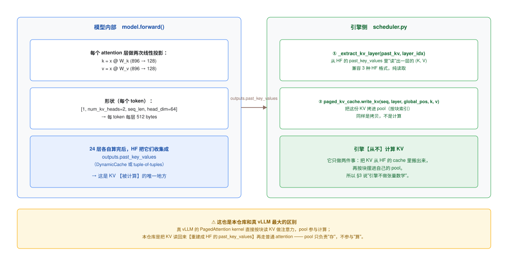
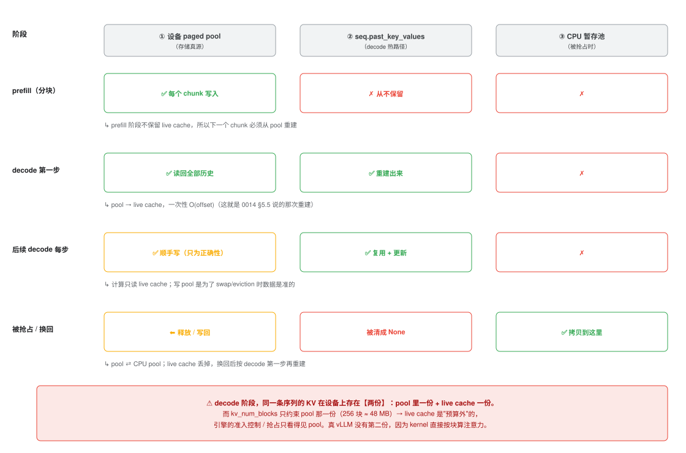

# KV cache 的一生：谁计算它、存在哪、怎么被复用

这篇文档回答四个连在一起的问题：

1. **KV 到底是谁算出来的？** 我在引擎里翻遍了也没找到"计算 KV"的代码。
2. **为什么第一个 chunk 要一次性把所有 block 分完，后面的 chunk 却要传 `past_key_values`？**
3. **为什么要单独设计一个 pool？** 直接把 HF 的 cache 挂在 `Sequence` 上不行吗？
4. 结合 Transformer 的 forward，**各个步骤的流转到底长什么样**？

> 相关：[`0014-prefill-and-chunking.md`](0014-prefill-and-chunking.md)（分块 prefill 全流程）、
> [`0005-blog-prefill-decode.md`](0005-blog-prefill-decode.md)（Transformer / KV cache 原理）、
> [`0009-attention-landscape.md`](0009-attention-landscape.md)（PagedAttention 在注意力优化里的位置）。

---

## 0. 一页速查

| 问题 | 答案 |
| --- | --- |
| KV 谁算的 | **模型内部的 `W_k` / `W_v` 两个线性层**。引擎**从不计算** KV，只搬运 |
| 引擎做了什么 | `_extract_kv_layer()` 读出来 → `write_kv()` 拷进 pool。**纯拷贝** |
| 首个 chunk 为什么一次性分块 | `prompt_len` 在分词后就已知 → 需求可一次算清；块表定死则 `global_pos` 映射随时可查；OOM 处理只需在首个 chunk 做一次 |
| 后续 chunk 为什么要 `past_kv` | 注意力必须看 `[0, offset)`；而 prefill 阶段**不保留 live cache** → 只能从 pool 重建 |
| 为什么要 pool | ① 可换出 ② 可记账/准入 ③ 消碎片 ④ 统一可观测。**但本仓库的 pool 不参与计算** |
| 代价 | decode 阶段 KV **在设备上存两份**（pool + live cache），而 `kv_num_blocks` 只约束其中一份 |

---

## 1. KV 是谁计算的？—— 在 Transformer 内部，不在引擎里



### 1.1 KV 由 `W_k` / `W_v` 算出来

Transformer 每一层的 self-attention 都有两个线性投影：

$$k_t = x_t W_K,\qquad v_t = x_t W_V$$

Qwen2-0.5B 的具体形状（实测）：

| 项 | 值 |
| --- | --- |
| `hidden_size` | 896 |
| `num_attention_heads` / `num_key_value_heads` | 14 / **2**（GQA） |
| `head_dim` | 64 |
| `k_proj.weight` / `v_proj.weight` | `[128, 896]`，即 `[num_kv_heads × head_dim, hidden]` |
| 层数 | 24 |

所以 **每 token 每层** KV = `2 heads × 64 dim × 2 bytes × 2 (K和V)` = **512 bytes**，
× 24 层 = **12 KB/token** —— 正好和 `0005` 里那个"本项目 12 KB/token"对上。

### 1.2 引擎只做"搬运"

引擎侧对 KV 只有两个动作（都在 `scheduler.py`）：

```python
layer_key, layer_val = _extract_kv_layer(new_past_kv, layer_idx)   # ← 读
self.paged_kv_cache.write_kv(seq.seq_id, layer_idx, global_pos, key_slice, val_slice)  # ← 拷
```

`_extract_kv_layer()` 的 docstring 说得很清楚 —— 它要兼容 HF 的**三种** `past_key_values` 格式
（旧式 tuple-of-tuples / `DynamicCache.key_cache` / `DynamicCache.layers`），
但它**只负责"把某一层的 (K, V) 取出来"**，不做任何数学。

### 1.3 这暴露了本仓库和真 vLLM 的根本区别

| | 真 vLLM | 本仓库 |
| --- | --- | --- |
| 注意力怎么算 | **PagedAttention kernel 直接按 block 读 KV** | 把 KV **读回来重建成 HF `past_key_values`**，再走普通 attention |
| pool 的角色 | **计算时直接寻址的对象** | 只是"**存储真源 + swap 载体**" |
| 需要"重建"吗 | 不需要 | **需要**（`reconstruct_*`，见 [`0014`](0014-prefill-and-chunking.md) §7.5） |

> 这句话解释了后面所有的"为什么"：**本仓库的 `block` 是纯存储概念，
> 没有任何 kernel 依赖它。** 所以它才能自由地把 `block_size=16` 和
> `prefill_chunk_size=128` 设成不相干的两个值。

---

## 2. 一次 forward 里 KV 的完整流转

以"Qwen2-0.5B + 一个 2 token 的 chunk"为例，逐步看数据：

```
① input_ids = [[t0, t1]]                                ← 引擎准备，形状 [1, 2]

② model.forward(...)
   ├─ embedding:            [1, 2]      → [1, 2, 896]
   ├─ layer 0:
   │    ├─ q = x @ W_q                                → [1, 14, 2, 64]
   │    ├─ k = x @ W_k                                → [1,  2, 2, 64]   ← ★ KV 在这里诞生
   │    ├─ v = x @ W_v                                → [1,  2, 2, 64]   ← ★
   │    ├─ attention(q, k, v, past_kv)                → [1, 2, 896]
   │    └─ MLP ...
   ├─ layer 1 … layer 23（各自同样算自己的 k/v）
   ├─ final norm:           → [1, 2, 896]
   └─ lm_head:              → logits [1, 2, 151936]

③ HF 把 24 层的 (k, v) 收集成 outputs.past_key_values
   （内部是 DynamicCache；每层 k/v 形状 [1, 2, 2, 64]，2 = 本 chunk 的 token 数）

④ 引擎：
   for layer in 0..23:
       (k, v) = _extract_kv_layer(outputs.past_key_values, layer)   # 读，形状 [1,2,2,64]
       for i in 0..chunk_len-1:                                     # 逐个 token
           write_kv(seq, layer, global_pos = chunk_start + i, k[:, :, i, :], v[:, :, i, :])
                                                                     # 拷进 pool
⑤ seq.prefill_offset += chunk_len
```

**几个值得注意的点**：

- **KV 是"算出来"的**（步骤 ② 里的两次矩阵乘），引擎在 ④ 只是把它**搬进自己的池子**；
- **写入是按 token 逐个写**（内层 for），不是整块写 —— 所以 `write_kv` 需要 `global_pos`
  才能算出"这个 token 落在哪个 block 的哪个 slot"；
- **越界的 logits 被浪费**：中间 chunk 只取 KV，`logits` 白算（**F32，已修复**：加 `logits_to_keep=1`，实测提速 ~24%）；
- 步骤 ③→④ 之间那个 `outputs.past_key_values` 是**临时对象**：写完池子后就被丢掉，
  引擎不保留它（所以下一个 chunk 要重建，见 §4）。

---

## 3. 为什么首个 chunk 要"一次性分块"？

```python
# _prefill_chunk_blocking, is_first_chunk 分支
blocks_needed = math.ceil(prompt_len / self.config.kv_block_size)   # ← 整段 prompt！
block_ids = self.block_allocator.allocate(seq.seq_id, blocks_needed)
```

### 三个理由

| # | 理由 |
| --- | --- |
| 1 | **总需求已经已知**：`prompt_len` 在 `add_request` 分词后就定了 → `ceil(prompt_len / 16)` 直接算得出，不需要"边走边要" |
| 2 | **块表一次定死 → 位置映射随时可查**：`write_kv` 里 `physical_block_id = block_ids[global_pos // block_size]`。只要 `block_ids` 不再变，**任意 global_pos 都能直接映射**。若按 chunk 动态增长块表，映射时要更小心 |
| 3 | **OOM / 抢占逻辑只需要写一次**：现在的代码在**第一个 chunk** 里处理 `OutOfBlocksError → 抢占 → 重试`。如果需求分次增长，就得在**每个 chunk** 都处理一遍 OOM |

### 代价（这也是它最明显的问题）

- **长 prompt 一上来就吃满显存**：622 token 要 39 块；4 个这样的请求要 156/256 块；
- 所以本仓库的 OOM **几乎总是发生在第一个 chunk**；
- 记账是渐进的（`set_token_count(chunk_end)` 逐步更新、`kv_tracker` 也是），
  但**块在第一步就已经占住了** —— 于是"已占 39 块但只写了 128 token"这个中间态会持续存在。

> **改进方向**：按 chunk 增量分配块（真 vLLM 就是"算到哪分到哪"）。
> 那样 `blocks_needed` 不再是"整段的预估"，OOM 也变成"某一步不够"而不是"一上来就不够"。
> 这个改动会牵动 `write_kv` 的映射逻辑和 OOM 处理位置，属于结构性改动。

---

## 4. 为什么后续 chunk 要传 `past_key_values`？

```python
# 非首个 chunk
past_kv = build_past_key_values(seq_id=seq.seq_id, paged_kv_cache=..., ...)   # 从 pool 读回 [0, offset)
outputs = self.model(input_ids=chunk_ids, past_key_values=past_kv, use_cache=True)
```

### 两个原因

**⑴ 注意力必须看得见前面**（语义要求）

Chunk 是 prompt 的一个**片段**，但第 `i` 个 token 的注意力要看 `[0, i]`。
不传 `past_kv` 的话，`[128, 256)` 这批 token 就只能互相看 —— 相当于把 prompt 从中间截断，
**输出直接跑偏**。

**⑵ 这份 KV 此刻不在内存里**（实现现状）

**prefill 阶段从不把 `outputs.past_key_values` 挂到 `seq` 上**（§2 步骤 ④ 之后它就丢了）。
所以下一个 chunk 只能**从 pool 重建** —— 这就是 `build_past_key_values` 的调用来源。

### ⚠️ 但这里有个不对称（F33）

| | 计算时读什么 | 为什么 |
| --- | --- | --- |
| **decode** | `seq.past_key_values`（**live cache**） | MPS 上从 pool 重建约 **240 ms/token**，而一次 forward 只要 ~24 ms → 必须留 live cache |
| **chunked prefill** | **每个中间 chunk 都从 pool 重建一次** | 代码里 `seq.past_key_values` 在 prefill 阶段始终是 `None` |

**理论上可以统一**（prefill 也保留 live cache，下一 chunk 直接用），
但**实测收益测不出来**：

| `PREFILL_CHUNK_SIZE` | chunk 数 | 重建次数 | TTFT |
| --- | --- | --- | --- |
| 512 | 2 | 1 | 916 / 931 ms |
| 64 | 10 | **9** | 954 / 907 ms |

两者在噪声内 —— 因为重建是**一次批量 `torch.cat` + `permute`**（常数很小），
而 forward 是 0.5B 参数的前向，完全主导。所以 **F33 是"整洁性问题"，不是性能问题**，
优先级低。

> 注意别把两个数字混了：decode 那个 **240 ms/token** 是"逐 token 的 read+permute+update"
> （很多小 tensor 操作）；prefill 的 chunk 重建是**一次大操作**，量级完全不同。

---

## 5. 为什么需要一个单独的 pool？

直接把 HF 的 `past_key_values` 挂在 `Sequence` 上，不也能跑吗？（Phase 1 就是这么干的）
答案是**四个理由**：

| # | 理由 | 如果不用 pool 会怎样 |
| --- | --- | --- |
| 1 | **可换出**（swap） | HF 的 per-sequence cache 是**整块大张量**，没法"释放一部分、保留数据"。只有自己管块，才能"把某序列的块拷到 CPU 并归还设备块" |
| 2 | **可记账 + 做准入** | 块表告诉你"谁占了多少" → 才能算 `num_free_blocks()`、做 `running_limit` 准入、在做 OOM 前抢占 |
| 3 | **消外部碎片** | 标准 transformers 要按 `max_sequence_length` 预留 → 60~80% 浪费（这正是 PagedAttention 的原始动机）。固定 16-token 块按实际长度分配 |
| 4 | **统一 + 可观测** | 所有序列共用一个池 → `/metrics` 能报 `paged_kv_cache.block_allocator` 的真实占用 |

### ⚠️ 但本仓库的 pool 有个额外代价

因为**不用 PagedAttention kernel**（§1.3），pool **不参与计算** → 于是：

```
decode 阶段，同一条序列的 KV 在设备上存在【两份】：
   ① pool 里一份（为了 swap/eviction，每步顺手写）
   ② seq.past_key_values 一份（live HF cache，计算时真正读的）
```

而 **`kv_num_blocks` 只约束 pool 那一份**（256 块 × 16 token × 12 KB ≈ **48 MB**）：

- pool 的容量用于**准入控制**（`blocks_needed = ceil(prompt_len/16)`）和**抢占判断**；
- **live cache 完全在预算之外** —— 它的大小取决于"当前 resident 的序列有多长"，
  不受 `kv_num_blocks` 约束；
- 所以真实 KV 显存 ≈ **pool 48 MB + 所有 live cache 之和**，
  而引擎的准入控制只看得见前者。

**真 vLLM 没有第二份**，因为 kernel 直接按块算注意力 —— live cache 这个概念在那里根本不存在。

> 换句话说：本仓库付出了"两份 KV"的代价，换来的是"能演示 swap"。
> 这是教学取舍，不是性能最优解。

---

## 6. KV 在四个阶段分别在哪



| 阶段 | ① 设备 pool | ② `seq.past_key_values` | ③ CPU 池 |
| --- | --- | --- | --- |
| **prefill（分块）** | ✅ 每个 chunk 写入 | ✗ 从不保留 | ✗ |
| **decode 第一步** | ✅ 读回全部历史 | ✅ 重建出来 | ✗ |
| **后续 decode 每步** | ✅ 顺手写（只为正确性） | ✅ 复用 + 更新 | ✗ |
| **被抢占 / 换回** | ⬅ 释放 / 写回 | 被清成 `None` | ✅ 拷贝到这里 |

把这张表和 [`0014`](0014-prefill-and-chunking.md) §5.5 的三存放点对照着看，
就等于 KV 的完整生命周期。

---

## 7. 完整时序（一个 5-chunk 的请求）

```
add_request
  ├─ tokenizer(prompt) → prompt_token_ids（长度 602）
  └─ Sequence.create(...)  arrival_time 记下

step 1  admit → 分配 ceil(602/16)=38 块（整段！）
        chunk#0: past_kv = None
                 forward(128 token) → outputs.past_key_values（临时）
                 → 提取 → write_kv 到 pool 位置 [0,128)
                 → 丢弃 outputs（live cache 不保留）
                 offset = 128

step 2  chunk#1: past_kv = build_past_key_values()  ← 从 pool 重建 [0,128)
                 forward(128 token) → 提取 → write_kv [128,256)
                 offset = 256
        （此时另一个序列可能在做它的 chunk#0 —— 这就是交错）

step 3  chunk#2 …  同上
step 4  chunk#3 …  同上

step 5  chunk#4: 最后一个 chunk（90 token）
                 forward → 提取 → write_kv [512,602)
                 logits[:, -1, :] → 采样首个 token → generated_token_ids=[t]
                 ttft_ms 记下；state = decoding

step 6  decode#1: past_kv = seq.past_key_values  → None！
                  → build_past_key_values()  ← 唯一一次"pool → live"重建
                  forward([[t]]) → 新 KV → 更新 live + 顺手 write_kv
                  state 保持 decoding

step 7+ decode#2…: 直接用 live cache，不再重建
                   每步：argmax → append → 写 pool（备份）
                   EOS 或 max_new_tokens → state = finished

finish  clear_sequence() + block_allocator.free()   ← 块归还，池子回到初始状态
        future.set_result(seq)                     ← 唤醒 HTTP handler
        （但 Sequence 对象留在 self.finished 里给指标/span 用，见 0002）
```

**只有两步有"重"的开销**：step 1（一次性分配 + 冷启动 forward）和 step 6（唯一一次重建）。
step 2~5 是"重建 + 一个 chunk 的 forward"，step 7+ 是最轻的。

---

## 8. 一句话总结

| 问题 | 一句话 |
| --- | --- |
| KV 谁算的 | **模型里的 `W_k` / `W_v`**；引擎只搬运（`_extract_kv_layer` + `write_kv`） |
| 首个 chunk 为什么一次分完 | 总需求已知 + 块表定死好查 + OOM 处理写一次就够；代价是"一上来就占满、OOM 总在第一步" |
| 后续 chunk 为什么要 `past_kv` | 注意力必须看 `[0, offset)`；而 prefill 不保留 live cache → 只能从 pool 重建 |
| 为什么要 pool | 为了**能换出、能记账、消碎片、能观测** —— 但要付出"decode 期间两份 KV"的代价 |
| 为什么真 vLLM 不需要重建 | 它的 kernel 按 block 直接算注意力，pool 就是计算对象 |
